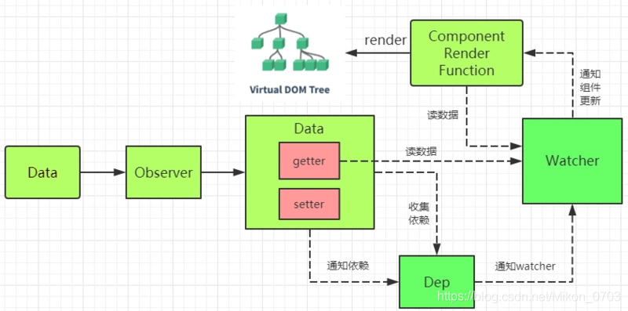

# Vue 深入学习记录文档

#### 开发一个库时，有两手准备，一个是库的开发，一个是库的测试（使用）

## Mustache 模板引擎

Mustache 可以说是最早的模板引擎，比 vue 早很多，Mustache 是胡子的意思，因为它的嵌入语法是{{}}，就像一个胡子。
Mustache 即可以用于 node，npm 下载，又可以用于浏览器环境，即是 umd，通用的。
Mustcache 可以被用于 html 文件，配置文件，源代码等等很多场景。它的运行得益于扩展一些标签在模板文件中，然后使用一个 hash 字典或者对象对其进行替换渲染。有一个很重要的点，它是无逻辑的。即不能在里面写 if else 等逻辑语句。Vue 也是一种模板引擎，并且更加优雅，学习 Mustache 就是为了先了解下数据-视图的思路。

### 数据-视图的历史

1. 纯 DOM 法：非常笨拙，没有实战价值。
2. 数组 join 法：曾几何时非常流行，是曾经的前端必会知识
3. ES6 中新增的模板字符串
4. 模板引擎：数据-视图的优雅解决方案。

### Mustache 基本语法

1. 插值语法 {{x}}
2. 是否存在(类似 v-if) {{#m}} ... {{/m}}
3. 简单数组循环(类似 v-for) {{#arr}} {{.}} {{/arr}}
4. 对象数组循环(类似 v-for) {{#arr}} {{x}} {{/arr}} -x 即对象内的某个属性

### Mustache 底层核心机理

Mustache 底层核心机理很多都被 Vue 借鉴

重点分为两步：

1. 将模板字符串编译为 tokens 形式（源代码 nestTokens，可以打印出 tokens）
2. 将 tokens 结合数据，解析为 dom 字符串

#### Mustache 库不能用简单的正则表达式思路实现

- 在较为简单的实例情况下，可以使用正则表达式实现。如插值语法
- 但是当情况复杂时，正则表达式的思路就不行了，比如循环语法

#### tokens（象征；代币）

tokens 是一个 JS 的嵌套数组，说白了，就是模板字符串的 JS 表示
它是“抽象语法树(ast)”、“虚拟节点” 等等的开山鼻祖

1. 比如 `<h1>hello {{name1}}</h1>，今天很{{mood}}`
   会被解析为

```
tokens = [
    ["text" ,"<h1>hello "],
    ["name" ,"name1"],
    ["text" ,"</h1>，今天很"],
    ["name" ,"mood"],
]
```

2. 比如

```
 <div>
     <ul id="list">
         {{#arr}}
         <li>{{.}}</li>
         {{/arr}}
     </ul>
 </div>
```

就会被解析为

```
[
    ["test",'<div><ul id="list">'],
    ["#","arr",[
        ["text","<li>"],
        ["name","."],
        ["text","</li>"],
    ]]
]
```

#### 数据结构

栈结构：先进后出（first in last out - FILO），就像往一个容器里放东西，先放的东西会被后放的东西压着，拿出来时需要先拿后放的。

## Mustache 模板引擎总结

总结还是分为二步

1. 将模板字符串转化为 tokens 数组 --嵌套的数组模式，用嵌套的数组来表示 dom 和数据的关系。这一步的实现个人认为算法是最精妙的。使用了栈结构以及引用类型。
2. 用 tokens 数组和数据组装出最后的 dom 字符串。这一步最关键的就是在遇到#号后，需要判断该 token 的数据类型，当类型是数组是需要通过循环递归得到最后的 dom 字符串。这一步纯个人实现

这个简易版的 Mustache，实现了主干功能，对它进行手写确实会收获良多。

<!-- 暂停一下，学习一下JSX -->

## Vue 高阶用法或最佳实践

- 组件和 mixin 对比，使用场景区分
- 组件通信（增加 vuex 和本地存储如 sessionStorage 的对比）
- 渲染函数和 JSX
- vuex 中 mutation 和 aciton 对比
- watch 和 computed 对比
- require.context 运用（如全局组件注册）
- 开发插件
- 开发过滤器

## 虚拟 dom 和 diff 算法

虚拟 dom：用 js 对象描述 DOM 的层次结构。Dom 中的一切属性都在虚拟 Dom 中有对应的属性。
diff 算法：最小量更新。

diff 是发生再虚拟 dom 上的，新老虚拟 dom 进行 diff，算出应该如何最小量更新，最后反映到真正的 dom 上。
原因很简单，直接用真实 dom 比较麻烦且耗性能。

弄懂三个事情：

1. 虚拟 dom 如何被渲染函数（h 函数）产生？手写 h 函数
2. diff 算法原理？手写 diff 算法
3. 虚拟 dom 如何通过 diff 变为真正的 dom，实际上，这一部分是涵盖在 diff 算法里面的。

# 现在很多的源码库都是使用 ts 编写，对 ts 的学习应该提上日程了。

//
snabbdom 是著名的虚拟 DOM 库，是 diff 算法的鼻祖，Vue 源码借鉴了 snabbdom

### 虚拟 dom 有哪些属性？

```js
const vnode = {
  children: [], // 子元素
  data: {}, //属性样式
  elm: undefined, //该虚拟dom真正的dom节点，undefined表示还未上树
  sel: 'div', // 选择器
  text: ''
};
```

在 vue 中写 render 函数时，使用 h 函数，第三个参数即使渲染单个 dom，也要写成数组形式。

### 手写 h 函数

### diff 算法

1. 最小量更新可以通过手动修改浏览器中渲染出来的 dom 值验证。验证后发现确实是最小量更新。当然需要有 key 值，如果没有 key 值默认按照顺序匹配。key 是这个节点的唯一标识，告诉 diff 算法，在更改前后它们是同一个 DOM 节点。
2. 只有同一个虚拟节点，才进行精细化比较。否则就是暴力删除旧的、插入新的。如何定义是同一个虚拟节点？答：选择器相同且 key 相同。
3. 只进行同层比较，不会进行跨层比较。如果不同层，即使是同一个虚拟 dom 也不会进行精细化比较，直接删除旧的 DOM，插入新的 DOM。

可以发现 diff 算法不是那么完美，考虑到了所有情况。但是却是合理的优化，为了不常见的应用场景去大大加大代码复杂性，并不划算。

#### 经典的 diff 算法优化策略

四种命中查找（不是 snabbdom 的专利，是 diff 算法的经典查找）：

该算法做的事情，最高效寻找到相同虚拟节点，找到后使用 patchVnode 方法更新。如果都未找到，则也是通过循环 新增或者删除。
做如下对比。按顺序查找，有一种命中后就不再查找。命中后前指针往下移，后指针往前移。

1. 新前与旧前：
   实际应用中，若 v-for 循环的数组长度未变化，只变化各项内容时。只用到该种判断即可完成。
   若是按顺在在数组末尾添加项，除添加项外的其他项也只用该种匹配，添加项 4 种匹配都匹配不上，因为旧虚拟节点中没有。
   所以其实新前与旧前，就占了开发中最有可能出现的两种情况。
2. 新后与旧后：
   该种匹配针对非行尾插入项。根据插入位置，插入位置之前的项通过新前与旧前匹配，插入位置之后的项就通过新后与旧后匹配。
3. 新后与旧前
   涉及移动节点，新前指向的节点，移动到旧后之后

4. 新前与旧后 -- 涉及移动节点，新后指向的节点，移动到旧前之前

3 和 4 两种情况涉及到节点移动，这其实已经是很不常见的情形了，对于 3、4 之间的顺序本人是没有像想到实际场景去对比谁更容易出现，大家如果有例子还请告知。关键还是 1 和 2 的两种匹配提高了匹配效率。

该部分完结：
收获：两数组查找，可以使用 keyMap 匹配方式，高效很多。
指针前移和指针后移这个方法虽然已经可以写出来，但是并未能真正理解其本质意图。到底为什么能产生这种效果。

响应式原理：

### 依赖收集

什么是依赖？
需要用到数据的地方，称为依赖
Vue1.x，细粒度依赖，用到数据的 DOM 都是依赖;
Vue2.x，中等粒度依赖，用到数据的组件都是依赖;

在 getter 中收集依赖，在 setter 中触发依赖

### 为什么要收集依赖

通过收集依赖才能知道哪些地方依赖此数据，以及数据更新和派发更新。
核心思想：事件发布-订阅模式
重要角色：订阅者 Dep 和观察者 Watcher

Dep 类：把依赖收集的代码封装成一个 Dep 类，它专门用来管理依赖，每个 Observe 的实例，成员中都有一个 Dep 的实例；
Watcher 类：Watcher 是一个中介，数据发生变化时通过 Watcher 中转，通知组件。


1. 依赖就是 Watcher，Watcher 对应一个 Vue 实例组件，对应于一个视图。只有 Watcher 触发的 getter 才会收集依赖，哪个 Watcher 触发了 getter，就把哪个 Watcher 收集到 Dep 中。
2. Dep 使用了发布订阅模式，当数据发生变化时，会循环依赖列表，把所有 Watcher 都通知一遍。
3. 代码实现的巧妙之处：Watcher 把自己设置到全局的一个指定位置，然后读取数据，因为读取了数据，所以会触发这个数据的 getter。在 getter 中就能得到当前正在读取数据的 watcher，并把这个 watcher 收集到 Dep 中。

数据发生变化，会重新渲染页面，这个过程存在以下三个步骤

1. 侦查数据的变化 —— 数据劫持/数据代理
2. 收集视图依赖的数据 —— 依赖收集
3. 数据变化时，自动通知需要更新的视图部分进行更新 —— 发布-订阅模式

vue 实例 初始化 => 利用 Observe 将 data 转为可侦测形式(getter/setter) => mount 声明周期时初始化该 Vue 实例的 Wathcer 实例，Dep.target 指向该 Wathcer，依赖收集开始。 => 视图渲染时访问 data，触发 getter 函数，就会将该 Watcher 收集到 Dep 中 => 数据发生改变时触发 settter => 通知之前依赖收集后存放在 Dep 中的 每个 watcher，数据改变了，进行视图更新。

# x

需要做词法分析的时候，经常要用到栈这个数据结构;
当上下级之间存在关系时，比方说例子当中，上级的字符串是通过下一级字符串拼装而成。这种情况下就会有栈是否为空的判断。
为空时就代表它是最外层的，而不为空时代表它是子串，子串时关注如何生成父串，答案是将自己叠加到父串变量中。

# 源码学习注意点

1. 学习源码时，要借鉴而不是抄袭，要能够发现书中写的精彩的部分。
2. 将独立的功能拆分为独立的 js 文件完成，通常是一个独立的类，每个单独的功能必须能独立的"单元测试"
3. 应围绕核心功能，先把主干完成，然后修剪枝叶。
4. 功能不需要或者说很难一步到位，功能一步步拓展，非核心功能甚至可以舍去。

## 手写 AST 抽象语法树

vue 的底层，包括 vue-loader。其实是把<template></template>标签内部的内容当做字符串处理的。
