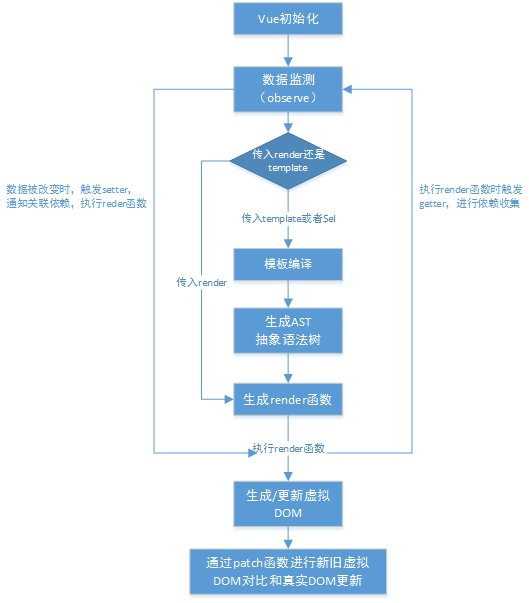

# 一、初始化流程

探索 Vue 的原理。个人比较想搞清楚的就是下面这个问题。
视图如何与模板绑定？我们在 template 中写下 类似 html 的结构，最终呈现的页面如何绑定上 data 中的数据。

# 二、数据监测

# 三、模板编译

模板编译即把template当做一个模板字符串，对其进行词法分析，，template 要么是 vue 文件中的 template 节点中的内容，要么是\$el 的 outerHTML。

# 四、patch 详解
