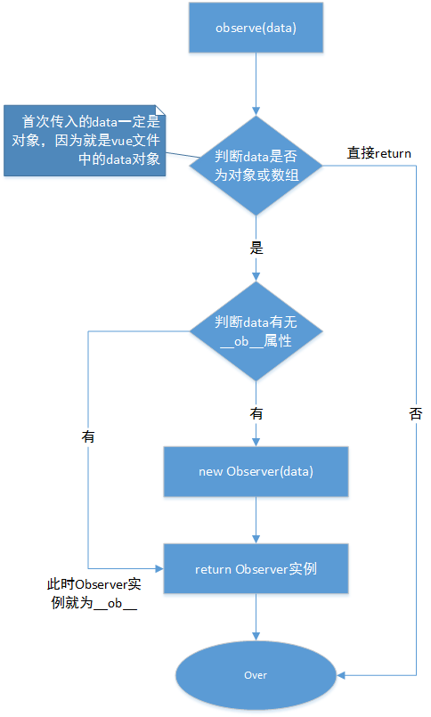
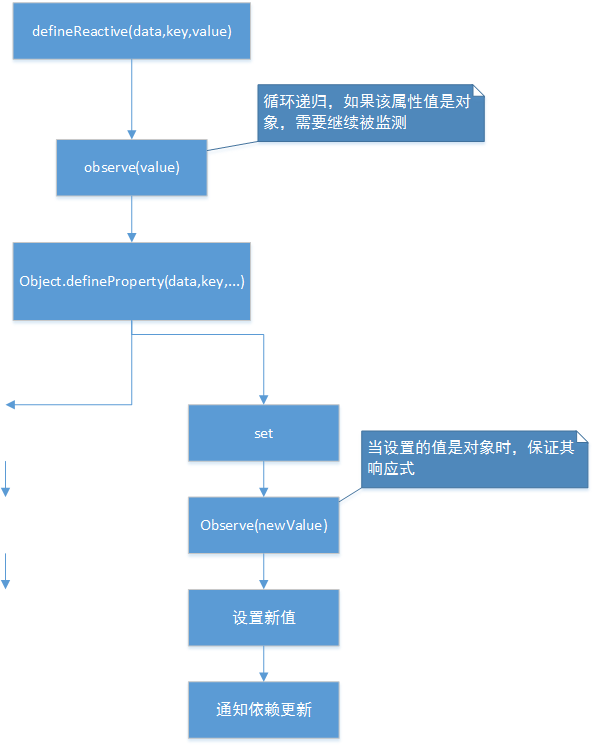

Vue 中视图如何与模板绑定？我们在 template 中写下 类似 html 的结构，最终呈现的页面如何绑定上 data 中的数据？  
本文全文就这个问题进行分析，首先看下 Vue 初始化的关键步骤。
;
用一个非常简单的模板和其对应的数据，依照上面的流程图，逐个分析下关键步骤的原理。模板如下所示：

```
<!-- template -->
<div id="myVue">
    <div>
        {{x}}
    </div>
    <button onclick="add()">x++</button>
    <input type="text" v-model="x">
</div>
```

```
// data

data: {
  x: 1,
},
```

最终要达到的效果：

1. 模板中的数据被正确编译了，即双大括号和指令生效。
2. 模板中的数据是响应式的，当改变数据时，视图能够自动更新。

# 一、初始化流程

首先创建 MyVue 类，按顺序进行调用数据监测和模板编译，以及做了一个数据代理，将 data 上的数据直接绑定在 MyVue 实例上，方便访问。

```
// MyVue.js

class MyVue {
  constructor(options = {}) {
    this.$options = options;
    this._data = options.data;
    observe(this._data);  // 将数据变为响应式
    this._initData();
    new Compile(options.el, this);
  }
  /* 将data直接绑定在Vue实例上，方便访问，不需要多一层_data */
  _initData() {
    Object.keys(this._data).forEach(key => {
      Object.defineProperty(this, key, {
        get: () => {
          return this._data[key];
        },
        set: value => {
          this._data[key] = value;
        }
      });
    });
  }
}
export default MyVue;
```

如果大家看一下目录，可能会有疑问，流程图的顺序和本文分析的顺序是不一样的。对于 Vue 初始化流程来说，是先进行数据监测，再进行模板编译和视图更新。执行过程也必须是这样。而之所以分析时先分析模板编译，是本人学习时得出的经验。

1. 我认为模板编译是解开 Vue 神秘面纱的第一步，对在 template 中写下的类似 html 结构，如何展示到页面上有了基本的认识。
2. 模板编译前面一大段逻辑和数据监测并没有关系，只有最后执行 render 函数，渲染视图时，才会用到数据监测，没有数据监测也只是绑定失效而已。
3. 学完模板编译后，数据监测就变得呼之欲出了。相反如果先学习数据监测，其实整个思路上是不那么顺畅，学完后不知道用来干嘛。

# 二、模板编译

模板编译即把 template 当做一个模板字符串，对其进行词法分析。生成 AST 抽象语法树。

## 1. 生成 ast 抽象语法树

### ast 编译结果

首先先来看下目标，上面的 template 被编译后需要生成类似以下结构：

```
{
  attrs:[
      {
          name:'id',
          value:'myVue'
      }
  ],
  tag:'div',
  type:1,
  children:[...],
  // 如果标签上带有指令会有directives属性
  directives:{
    name:'xx',
    value:'xx'
  },
  // 如果节点类型是文本节点，会带有text属性
  text:undefined
}
```

核心属性即以上几个，最外层 id 为 MyVue 的 div 是不带有 directives 和 text 属性的，但是它的 children 中有可能会出现，所以这里只是做一下示意。children 就是 MyVue 的子节点数组，子节点同样用一个类似以上的结构来表示。

### ast 生成过程

现在目标已经很明确了，把模板字符串编译成 ast 抽象语法树。难点在于要把各层级标签一一地统计出来。这里用到了栈结构，遇见开始标签入栈，遇到结束标签就出栈，那么在这个过程中收集到的内容，即是栈中最后一个元素标签的属性。具体代码如下：

```
// parse.js

import parseAttrs from './attrsString'; //提取模板中的标签属性

const SingleTagList = ['input', 'img', 'br']; // 单标签特殊处理，只列举了一些常见的
export default function parse(templateStr) {
  let index = 0;
  let restStr = templateStr;
  const stack = [];
  const aResult = [];
  const startRexExp = /^<(([a-z][a-z\d]*)(\s.+?)?)>/; //匹配开始标签
  const endRegExp = /^<\/([a-z][a-z\d]*)>/; //匹配结尾标签
  const contentRegExp = /(.+?)<\/?[a-z][a-z\d]*(\s.+?)?>/s; //匹配标签内容
  while (index < templateStr.length) {
    restStr = templateStr.slice(index);
    /* 匹配标签开头 */
    /* 匹配开头不能是数字，后面允许有数字 */
    if (startRexExp.test(restStr)) {
      // 压栈
      const startTag = RegExp.$1;
      const tagName = RegExp.$2;
      const attrsString = RegExp.$3;
      const oNodeInfo = {
        tag: tagName,
        type: Node.ELEMENT_NODE,
        children: []
      };
      const { attrs, directives } = parseAttrs(attrsString);
      if (attrs.length) {
        oNodeInfo.attrs = attrs;
      }
      if (directives.length) {
        oNodeInfo.directives = directives;
      }
      if (SingleTagList.includes(tagName)) {
        // 单标签，单标签开始即结束了，相当于进行了双标签的入栈和出栈操作
        if (stack.length) {
          const oLastNodeInfo = stack[stack.length - 1];
          oLastNodeInfo.children.push(oNodeInfo);
        } else {
          /* 暂时只匹配纯文本节点，不考虑其他节点和文本节点都有的情况 */
          aResult.push(oNodeInfo);
        }
      } else {
        // 双标签
        stack.push(oNodeInfo);
      }
      console.log(`检测到开始${tagName}`);

      // +2是把<>符号也算上了
      index += startTag.length + 2;
    } else if (endRegExp.test(restStr)) {
      /* 匹配标签结尾 */
      // 出栈
      const endTag = RegExp.$1;
      const oContent = stack.pop();
      if (!oContent || endTag !== oContent.tag) {
        throw new Error('模板字符串格式错误');
      }
      if (stack.length) {
        const oLastNodeInfo = stack[stack.length - 1];
        oLastNodeInfo.children.push(oContent);
      } else {
        /* 暂时只匹配纯文本节点，不考虑其他节点和文本节点都有的情况 */
        aResult.push(oContent);
      }
      console.log(`检测到结束${endTag}`);
      index += endTag.length + 3;
    } else if (contentRegExp.test(restStr)) {
      // 匹配文本节点，全为空的跳过，全为空说明是空格或换行，不需要统计
      let content = RegExp.$1;
      /* \s 就是[ \t\v\n\r\f]。表示空白符，包括空格、水平制表符、垂直制表符、换行符、回车符、换页符。*/
      if (!/^\s+$/.test(content)) {
        const oLastNodeInfo = stack[stack.length - 1];
        oLastNodeInfo.children.push({
          type: Node.TEXT_NODE,
          content: content.trim() //存入栈中的文本节点，去掉前后空格。但是index的叠加是需要算上空格的
        });
      }
      index += content.length;
    } else {
      index++;
      throw new Error('怎么进else了？排查下是何特殊情况');
    }
  }
  return aResult[0];
}

```

## 2.生成 render 函数

得到 ast 抽象语法树后，就要利用它生成 render 函数。同样地先来看下结果，即把上面的 template 改用 render 函数实现，熟悉 Vue 的小伙伴应该都很了解，代码大概如下：

```
  render(h) {
    return h('div', { attrs: { id: 'myVue' } }, [
      h('div', this.x),
      h(
        'button',
        'x++'
      ),
      h('input', {
        attrs: { type: 'text' },
        domProps: { value: this.x },
        on: {
          input: $event => {
            this.x = $event.target.value;
          }
        }
      })
    ]);
  }
```

所以现在的任务，就是需要利用 ast 动态生成一个类似上述的函数。动态生成函数使用 new Function() 传入字符串的做法。但是用这种方法生成的函数，其词法作用域是在全局，而不在生成该函数的位置。Vue 在这里做了一个巧妙的处理是利用 with 关键字改变作用域。如果不想使用这种方法，也可通过传参的形式，去使用外部的一些变量。具体代码：

```
// createRender.js

export default function createRender(ast) {
  return new Function('_h', `with (this) return ${createCode(ast)}`);
}
function createCode(ast) {
  const children = ast.children.map(child => {
    if (child.type === 3) {
      // 文本节点
      if (/{{(.+?)}}/.test(child.text)) {
        return `${RegExp.$1}`;
      } else {
        return `"${child.text}"`;
      }
    } else if (child.type === 1) {
      // 元素节点
      return createCode(child);
    }
  });
  const data = {};
  if (ast.attrs) {
    data.props = {};
    // 转成snabbdom库h函数需要的格式
    ast.attrs.forEach(item => {
      data.props[item.name] = item.value;
    });
  }
  if (ast.directives) {
    data.directives = ast.directives;
  }
  return `_h("${ast.tag}",${JSON.stringify(data)}, [${children.join(',')}])`;
}
```

生成的函数结果如下。

```
function anonymous(_h) {
  with (this)
    return _h('div', { props: { id: 'myVue' } }, [
      _h('div', {}, [x]),
      _h('button', { props: { id: 'addBtn' } }, ['x++']),
      _h('input', { props: { type: 'text' }, directives: [{ name: 'model', value: 'x' }] }, [])
    ]);
}
```

该函数中的 this 就是 vue 实例，所以访问的变量实际上就是访问 data 中的数据了。

这里的\_h 并不是 Vue 使用的 h 函数。利用 h 函数生成虚拟 DOM 并不是 Vue 开创的，Vue 借鉴了 snbbdom 库。所以这里我们直接通过 snbbdom 的 h 函数生成虚拟 DOM，\_h 是对 Vue 中的指令做一些特殊处理，使之符合 snbbdom 库 h 函数的传参，\_h 代码如下

```
// Compile.js

import { h } from 'snabbdom';
const _h = (sel, data, children) => {
  if (data.directives) {
    /* 处理指令，指令处理是相对复杂的，因为不同指令就要做不同的处理，该例子展示双向绑定，只对v-mode指令做处理 */
    data.directives.forEach(({ name, value }) => {
      if (name === 'model') {
        // 处理v-model指令，利用Watcher类监听指令绑定的数据的变化，改变时通知关联依赖进行视图更新
        new Watcher(this.$vue, value, () => {
          updateMain();
        });
        const inputFun = $event => {
          this.$vue[value] = $event.target.value;
        };
        data.props.value = this.$vue[value];
        data.on = {
          input: inputFun
        };
      }
      // 如果要处理其他指令，可以在这里扩展
    });
  }
  return h(sel, data, children);
};
```

## 3. 执行 render 函数和 patch 函数
   render 函数已经被创建出来了，执行 render 函数后便可以得到虚拟 DOM，为了先尽早看到结果，可以先用 snabbdom 库的 patch 函数进行虚拟 DOM 上树。后面再详细分析 patch 函数。render 函数和 patch 函数的执行，就是对视图的更新，所以将他们封装到一个函数内。

```
const updateMain = () => {
  this.newVnode = this.renderFun.call(this.$vue, _h);
  // 第一次执行时，oldVnode即为$el
  this.oldVnode = snabbdom.patch(this.oldVnode, this.newVnode);
};
```

把这些代码都整合一下，即使没有数据监测，视图也能正确展示了，只不过没有跟数据进行绑定。进行到这里，就需要分析数据监测了。因为如果没有数据监测，无法监听到数据的改变，那么就不知道什么时候执行 updateMain 函数。

# 三、数据监测

## 1. 达成的效果

数据监测想要实现的效果，在前文中已经给出了。这里把他们提炼出来：

```
observe(this._data);  // 将数据变为响应式
// 利用Watcher类监听数据变化，改变时通知关联依赖进行视图更新
new Watcher(this.$vue, value, () => {
  updateMain();
});

```

这两段代码是之前写过的。这里 new Watcher 传入的 this.$vue，可以改为this._data。因为_initData函数对this.$vue 做了数据代理，访问 this.\$vue 上的数据实际就是访问了 this.\_data。也就是访问了传入的 data。
那么这个目的又明确了，对传入的对象`data={x:1}`，调用 observe 方法进行数据监测后，使用 new Watcher 可以监听到其属性的变化，并且执行回调函数，任务就完成了。  
到这里可能有些小伙伴觉得这个事情好像很简单，这里又是 observe，又是 Watcher 类是不是搞复杂了。其实是因为本文的例子非常简单，数据监测的复杂性来自于这几点：

1. 对 data 对象的检测是深度监测，即可以监测多层。如果 data 是`data={obj1:{obj2:{x:1}}}`,依然可以对最后一层的 x 或者中间任意一层的属性进行监听。
2. 需要实现数组监听，中间任意一层如果有属性值为数组，也需要能够监听其变化。
3. 赋值后的数据，如果是对象或数组类型，也需要是响应式的。
4. 如果 data 的 x 属性被多个 Vue 组件使用，当 x 改变时要通知到每个组件进行视图更新。

展示一下最后的测试代码：

```
observe(this.testObj)
/* 模板编译时，如果模板中用到的数据，就主动调用Watcher类进行监听 */
new Watcher(this.testObj, 'b', () => {
  console.log('b被改变了');
});
this.testObj.b = 20
new Watcher(this.testObj, 'a.a1', () => {
  console.log('a1被改变了');
});
this.testObj.a.a1 = 10
new Watcher(this.testObj, 'c', () => {
  console.log('c被改变了');
});
this.testObj.c.push(3);
```

只要最后回调函数执行了，说明数据监测成功。

## 2.数据监测流程

数据监测的总体流程图如下所示，可以对照上面的模板解析过程理解。这里对 3 个重点功能进行一下说明：

1. Observer： 将一个普通对象转换为每个层级的属性都是响应式（可以被监测的）的对象。并且进行依赖收集和依赖触发。
2. Dep 类： 作为发布订阅模式的发布者，在依赖收集时，将该数据的依赖（订阅者）都保存起来，当数据发生变化时，会循环依赖列表，把所有 Watcher 都通知一遍。
3. Watcher 类：作为一个订阅者，当收到属性变化通知时，执行回调函数。
   ;
   这其中 Observer 完成的功能最多，所以呢它是被拆分成几个单元的，包含 observe 函数、Observer 类以及 defineReactive 函数。这些函数和类他们之间又存在互相引用关系，所以对这每个单元都画了一下流程图，除了帮助理解他它们身的功能外，主要是想辅助厘清它们之间的调用关系。

### observe 方法

首先根据测试代码，最先调用的就是 observe 方法，这个方法实现的目的就是对数据做一些判断和筛选，一是排除基本数据，因为只有对象或者数组需要做响应式处理。二是已经是响应式数据的对象不再重复处理。具体流程：

具体代码：

```
// observe.js

import defineReactive from './defineReactive';
import { def } from './util'; //def方法就是使用defineProperty去增加一个属性，并且传入配置项。
import { arrayMethods } from './array';
import observe from './observe';
import Dep from './Dep';

// 将一个普通Object对象转换为每个层级的属性都是响应式（可以被侦测的）的Object。
class Observer {
  constructor(value) {
    // 每一个Observer实例身上都有一个Dep实例，所以每一层（对象），都有一个Dep
    this.dep = new Dep();
    // __ob__属性，值是Observer实例对象，取名__ob__，是防止属性重名
    def(value, '__ob__', this, { enumerable: false });

    if (Array.isArray(value)) {
      // 如果是数组就强行将该数组的原型指向我们创建的以Array的Prototype为原型的对象。
      // 所以当下的关系是，  代码中的数组  =>  Vue创建的数组监测对象（arrayMethods）  => 数组的原型对象
      /*
      /这里比较精妙的点是创造了一个中间对象来监听，我之前一直认为是直接在Array的原型上改写，
      所以存在疑惑，直接在原型岂不是所有数组都是响应式的了？浪费性能了？ 实际上并不是。
      */
      Object.setPrototypeOf(value, arrayMethods);
      /* 上一步监听了数组的特定的变化函数，而下面是遍历数组，观察每一项的值 */
      this.observeArray(value);
      /* 数组的依赖收集在Observer类中进行，arrayMethods只是作为数据改变时的触发器 */
      if (Dep.target) {
        this.dep.depend();
      }
    } else {
      this.walk(value);
    }
  }
  // 遍历对象属性
  walk(obj) {
    for (const key in obj) {
      if (Object.hasOwnProperty.call(obj, key)) {
        defineReactive(obj, key);
      }
    }
  }
  // 遍历数组项
  observeArray(arr) {
    for (let i = 0, l = arr.length; i < l; i++) {
      observe(arr[i]);
    }
  }
}

export default Observer;

```

### defineReactive

Observer 类对数组和对象做了区分处理，具体的监听实现对象是用 defineReactive 方法，数组是用 arrayMethods 原型。所以这两部分有许多类似的地方。先说 defineReactive，defineReactive 主要功能就是使用 Object.defineProperty 实现属性的劫持和监听。具体功能如下：

实现如下：

```
//defineReactive.js

import observe from './observe';

import Dep from './Dep';

/*
为什么要定义这个函数？原因很简单，如果不使用一个函数封装，就需要一个中间变量中转，才能使getter和setter正常工作。
并且可以复用
*/
export default function defineReactive(data, key, value) {
  /* 每一个属性有其自己的dep，因为每一个属性都有可能会被多个vue调用，需要将其收集起来 */
  const dep = new Dep();
  if (arguments.length === 2) {
    value = data[key];
  }
  // 判断该属性值是否是复杂数据类型，如果是就调用observe继续监听。
  let childObj = observe(value);
  Object.defineProperty(data, key, {
    get() {
      console.log(`你正在访问${key}`);
      // getter时收集依赖
      // 如果现在处于依赖收集阶段
      if (Dep.target) {
        dep.depend();
        if (childObj) {
          childObj.dep.depend();
        }
      }
      return value;
    },
    set(newValue) {
      console.log(`你正在设置${key}`);

      /* 如果设置了一个新值，该值是对象同样需要观察，若不做这个处理，当赋值一个对象时，该对象无法成为响应式数据 */
      observe(newValue);
      /* setter时触发依赖 */
      value = newValue;
      dep.notify();
    }
  });
}

```

### arrayMethods

arrayMethodsfs 原型的处理类比 defineReactive 其实只是实现了类似 setter 的功能。监听了数组上对子项改变的方法。对于直接访问数组的某一项，如果该项是简单数据类型，是没有做劫持的。因为对 arrayMethods 对象的封装比较单线性，所以没有画流程图，直接看代码:

```
// array.js

import { def } from './util';

const methodsNeedChange = ['push', 'pop', 'shift', 'unshift', 'splice', 'sort', 'reverse'];
const arrayPrototype = Array.prototype;

const arrayMethods = Object.create(arrayPrototype);
methodsNeedChange.forEach(methodName => {
  /* 定义arrayMethods自己的方法，在原型链查找时就优先调用自身方法 */
  def(
    arrayMethods,
    methodName,
    function() {
      /* arguments是不管形参的，只管最终传入了多少实参.
      this必须要正确，因为像push等方法，它的目的就是去改变this数据的值的 */
      const result = arrayPrototype[methodName].apply(this, arguments); //调用Array原型上的方法，保证原有功能不影响
      /* 以下三种方式会在数组中加入项，要保证加入的项也是响应式的 */
      let inserted = [];
      if (methodName === 'push' || methodName === 'unshift') {
        inserted = [...arguments];
      } else if (methodName === 'splice') {
        inserted = [...arguments].slice(2);
      }
      if (inserted.length) {
        // this.__ob__就是在该数组上绑定的Observer类
        this.__ob__.observeArray(inserted);
      }
      this.__ob__.dep.notify();

      return result;
    },
    { enumerable: false }
  );
});

export { arrayMethods };


```

在原型上重写了 7 种改变数组的方法，所以只要调用这些方法，Vue 就实现监听。到这里为止，实现了将一个普通对象处理为每一层都是响应式的数据。如果不考虑数据被多个地方使用的情况。完全可以在数据被改变的地方协议触发函数，将被改变的数据属性名和改变后的值传回去。而我们在初始化的时候去监听这个触发函数，就可以接受到数据的改变了。  
为了解决数据可能被多个视图使用，所以这里又要通过 Dep 和 Watcher 实现发布订阅模式。

### Dep

Dep 作为发布者，需要添加每个订阅者，并将这些发布者保存起来。当数据改变时，对应的 Dep 就需要去通知保存的订阅者。什么时候添加订阅者，这里作为对象的属性和数组的子项是不一样的。 如果是对象的属性，在上面 defineReactive 中可以看到，就是在 getter 的时候收集依赖，添加订阅者。如果是数组的子项，那么变不会进行依赖收集。所以说直接通过下标去改变数组的某一项也就不会触发视图更新。  
用上面的 testObj 举例，访问 c 是会进行依赖收集的，。因为它作为 testObj 的一个属性，访问时触发 defineReactive 的 getter，进行依赖收集。但是访问 c[0]是不会进行依赖收集的。  
Dep 的具体代码如下所示：

```
let uid = 0;
/* Dep.target是类本身的属性，所以实际上成为了一个全局属性，只要引入Dep即可读取和设置 */
export default class Dep {
  constructor() {
    this.id = uid++;
    // 用数组存储订阅者
    this.subs = [];
  }
  // 添加订阅，即添加一个watcher实例对象
  addSub(sub) {
    this.subs.push(sub);
  }
  // 添加依赖
  depend() {
    // Dep.target实际上是一个全局性质的变量
    if (Dep.target) {
      /* 判断是否是重复依赖，若不做判断，get时候会一直收集重复依赖 */
      if (!this.subs.includes(Dep.target)) {
        this.addSub(Dep.target);
      }
    }
  }
  // 通知所有watcher对象更新视图，即分发消息。
  notify() {
    // 源码中是这么写的，为什么要浅克隆一份？
    const subs = this.subs.slice();
    console.log(subs, 'subs');
    for (let i = 0; i < subs.length; i++) {
      subs[i].update();
    }
  }
}
// 第一次将这个Dep的target属性设置为null
Dep.target = null;

```

代码中一直出现 Dep.target 属性。它的作用是将当前正在读取数据的依赖添加进自己的 Dep 中。Dep.target 属性平时一直是 null，只有等到 Watcher 类在读取数据前，会将 Dep.target 设置为自身。这个时候 Dep 收集到的就是正在读取数据的 Watcher。读取数据后，再将 Watcher 设置为 null。

### Watcher

Watcher 作为订阅者，在创建 Watcher 实例时会读取被检测对象的某个属性，此时就会进行依赖收集，该 Watcher 就订阅了 Dep。当数据发生改变时，Dep 就会通知自身的订阅者。Watcher 就会执行传入的回调函数，并返回新值和旧值。

```
// Watcher.js

import Dep from './Dep';
var uid = 0;

/*
   为什么引入Watcher？
   当属性发生变化时，我们要通知用到此数据属性的地方，而使用此数据的地方很多且类型不一样，需要抽象出一个类集中处理
   这些情况，然后再依赖收集阶段只收集这个封装好的实例，通知也只需要通知这一个，然后它在负责通知其他的地方。
*/

const parsePath = str => {
  let segments = str.split('.');
  return obj => {
    segments.forEach(segment => {
      obj = obj[segment];
    });
    return obj;
  };
};
export default class Watcher {
  constructor(vm, expression, callback) {
    this.id = uid++;
    this.vm = vm;
    this.getter = parsePath(expression);
    this.callback = callback;
    this.value = this.get();
  }
  update() {
    this.run();
  }
  run() {
    const value = this.get();
    // 当值发生改变时
    if (value !== this.value || typeof value === 'object') {
      const oldValue = this.value;
      this.value = value;
      this.callback.call(this.vm, value, oldValue);
    }
  }
  get() {
    // 进入依赖收集阶段，让全局的Dep.target设置为wathcer实例本身。
    Dep.target = this;
    const vm = this.vm;
    let value;
    // 只要能找，就一直找
    try {
      value = this.getter(vm);
    } finally {
      // 依赖收集结束
      Dep.target = null;
    }
    return value;
  }
}

```

至此数据监测分析结束了，整合以上代码去跑数据监测最开始的测试代码，是可以跑通的。并且把它放到初始化流程和模板编译中，也是可以正常运转的，也就是说双向绑定的效果已经实现了，只不过 h 函数和 patch 函数使用的 snabbdom 库。
到这里，模板编译和响应式原理都分析结束后，vue 的内部实现大概有所了解，最后呢再来分析下 DOM 的最小量更新。

# 四、虚拟 DOM 和 patch 函数 详解

在模板编译的最后阶段，直接调用了 snabbdom 库的 h 函数和 patch 函数。h 函数生成虚拟 DOM，patch 函数进行虚拟 DOM 上树以及虚拟 DOM 更新。接下来就简单实现一下这两个函数。这里说明下，patch 函数的分析重点分析它的 diff 算法，没有实现属性和方法的绑定。所以本文的双向绑定例子，最终也只能通过 snabbdom 库的函数去验证。

## 生成虚拟 DOM

首先也是要有个模板，这里就不用本文最开始的那个模板了。因为那个模板里面包含了指令、双大括号等一些 Vue 的专属语法。而底层 h 函数实际上就做一件事，就是根据传参生成虚拟 DOM，它是不管指令、花大括号这些东西的。而且方便后续 patch 函数的测试，这里再使用一个模板

```
<div id="myH">
  <h4 class="x">x</h4>
  <ul>
    <li>A</li>
    <li>B</li>
    <li>C</li>
  </ul>
</div>
```

这个模板使用 h 函数去生成一下，这个应该是很简单的，在模板编译中直接通过代码去动态生成了 h 函数，这里只是把它静态地写出来。

```
const vnode = h('div', { id: 'myH' }, [
  h('ul',[
    h('li','A'),
    h('li','B'),
    h('li','C'),
  ])
]);
```

看一下 vnode 长啥样。可能这里有小伙伴会觉得和 ast 抽象语法树很像。确实很像，因为它们都是通过一个 js 对象去描述一个真实 DOM 节点。但是两者还是有差异的。首先生成的过程有差异。ast 抽象语法树是去分析字符串生成，虚拟 DOM 是通过调用 h 函数生成。其次抽象语法树是为了 vue 服务的，它里面会拆解 vue 的一些特殊语法如指令等等。而 h 函数之前也说了它不管这些。从 ast 到虚拟 DOM 实际上经历了这些
ast 抽象语法树 => 动态生成 render 函数 => 执行 render 函数 => render 函数内部调用 h 函数 => 得到虚拟 DOM。

```
// vnode
{
    "sel": "div",
    "data": {
        "id": "myH"
    },
    "children": [
        {
            "sel": "ul",
            "data": {},
            "children": [
                {
                    "sel": "li",
                    "data": {},
                    "text": "A"
                },
                {
                    "sel": "li",
                    "data": {},
                    "text": "B"
                },
                {
                    "sel": "li",
                    "data": {},
                    "text": "C"
                }
            ]
        }
    ]
}
```

所有呢现在就是要去实现 h 函数，这一步实际是比较简单的，因为最终要生成的对象，它的属性实际上都是通过外部传入的，只需要规整一下。并且这里是没有递归的，每一层的对象都是通过 h 函数自己创建出来的。h 函数主要就是对参数个数和类型做了一个判断。所以这里直接上代码：

```
import vnode from './vnode';

// h.js
const isObj = obj => {
  return Object.prototype.toString.call(obj) === '[object Object]';
};
// vnode(sel, data, children, text, elm)
export default function(sel, data, c) {
  const length = arguments.length;
  if (length < 2) {
    throw new Error('least 2 params');
  }
  // 只有两个参数的情况，即中间的data被省略了或者没有children
  if (length === 2) {
    // sel + text
    if (typeof data === 'string' || typeof data === 'number') {
      return vnode(sel, undefined, undefined, data);
    }
    // sel + data
    if (isObj(data)) {
      return vnode(sel, data);
    }
    // sel + children
    if (Array.isArray(data)) {
      return vnode(sel, undefined, data);
    }
    throw new Error('参数类型错误！');
  } else {
    // 三个参数的情况
    if (!isObj(data)) {
      throw new Error('参数类型错误！');
    }
    // sel + data + text
    if (typeof c === 'string' || typeof c === 'number') {
      return vnode(sel, data, undefined, c);
    }
    // sel + data+children
    if (Array.isArray(c)) {
      return vnode(sel, data, c);
    }
    throw new Error('参数类型错误！');
  }
}

```

vnode 就是封装了一个函数，根据传入值最终输出虚拟 DOM 对象，如下：

```
// vnode.js

export default function(sel, data, children, text, elm) {
  let key;
  if (data) {
    key = data.key;
  } else {
  /* patch函数内部data不能为undefined */
    data = {};
  }
  return {
    sel,
    data,
    children,
    text,
    elm,
    key
  };
}

```

## patch 函数详解

patch 函数相对是比较复杂的，之前也提到 patch 函数这里只实现 DOM 上树和 DOM 更新逻辑，这是核心逻辑。不实现 DOM 属性和监听事件。

首先说明下 patch 的使用，其实模板编译最后也调用过。patch 需要传入两个参数，旧虚拟节点和新虚拟节点。旧虚拟节点可以是一个 DOM 对象，这也是首次上树时的场景。这里我们调用 patch，将上面生成的 vnode 虚拟 DOM 上树。

```
const container = document.getElementById('container')//页面上存放一个容器
patch(container,vnode)//vnode就是标题“生成虚拟DOM”中最后输出的虚拟DOM。
```

如果 patch 函数成功创建，那么执行的结果就是页面容器被替换成了模板的 DOM 结构。那么接下来就正式开始手写 patch 函数。

先看一下 patch 函数的整体流程图，后面就跟着这个流程图一步一步实现。并且在每一步做一些验证。

### 1. 新旧虚拟 DOM 为两个虚拟节点时

第一步先分析到精细化比较之前。先看下 patch 函数的整体代码。

```
// patch.js

import vnode from '../vnode';
import createEle from './createEle';

export default (oldVnode, newVnode) => {
  if (oldVnode.sel === undefined) {
    oldVnode = vnode(oldVnode.tagName, {}, [], '', oldVnode);
  }

  // 是否为同一个虚拟节点
  const keyIsSame = oldVnode.key === newVnode.key;
  const selIsSame = oldVnode.sel === newVnode.sel;
  if (keyIsSame && selIsSame) {
    patchVnode(oldVnode, newVnode);
  } else {
    // 不是同一个节点，插入新dom，删除旧dom
    const newDom = createEle(newVnode);
    if (!oldVnode.elm) {
      // 传入的oldVnode如果是真实DOM，调用vnode函数后就会带有elm属性。如果是虚拟DOM，必须是已经生成真实DOM的虚拟节点，即带有elm属性。
      return;
    }
    oldVnode.elm.parentNode.insertBefore(newDom, oldVnode.elm);
    oldVnode.elm.parentNode.removeChild(oldVnode.elm);
  }
};

```

上面代码就是 patch 函数最终的代码。但是先忽略是同一个虚拟 DOM 的情况，即可以把 patchVnode 函数那一行注释掉。
剩下的代码对照着流程图就比较好理解了，这里虚拟 DOM 上树时要注意一下，必须先插入新节点，再删除旧节点。不能反过来。因为反过来插入新节点时就没有一个参考项了。然后剩下 createEle 函数。该函数是将虚拟 DOM 创建为一个真实 DOM。看下代码：

```
// createEle.js

export default function createEle(vnode) {
  const dom = document.createElement(vnode.sel);
  if (vnode.children && vnode.children.length) {
    vnode.children.forEach(childVnode => {
      dom.appendChild(createEle(childVnode));
    });
  } else if (vnode.text) {
    // 简化版不允许又有children又有text的情况，二者互斥
    dom.innerHTML = vnode.text;
  }
  vnode.elm = dom;
  return dom;
}

```

上面代码比较简短，但是使用了递归，因为 vnode 是可能有子元素 children 的，每一个 children 也需要生成真实 DOM 并且被添加父元素中。

到这里呢，patch 函数的第一个作用，将虚拟 DOM 上树其实已经完成，可以拿来测试了。执行上文写到的`patch(container,vnode)`。就能够在页面上看到效果。

### 2.新旧虚拟 DOM 子节点不必进行详细对比

先解释下标题，新旧虚拟 DOM 子节点及 children 属性什么情况下需要进行详细对比？就是 children 依然都存在，都还是数组的情况下。如果任意一方 children 不再是数组（说明子节点中只剩下文本节点了），就不必进行详细对比。那么从流程图上看，是到“oldVnode 存在 text 还是 children”判断条件为止。

这一部分的逻辑就在 patchVnode 函数中，先看下代码：

```
//patch.js

const patchVnode = (oldVnode, newVnode) => {
  // 是同一个节点，进行精细化比较
  if (newVnode.text || newVnode.text === '') {
    if (newVnode.text === oldVnode.text) {
      // 新旧节点子节点都是文本节点，且text相同时，不需要做处理
      newVnode.elm = oldVnode.elm;
      return;
    } else {
      oldVnode.elm.innerText = newVnode.text;
      newVnode.elm = oldVnode.elm;
    }
  } else if (newVnode.children) {
    if (oldVnode.text) {
      // 1. 清空旧dom
      oldVnode.elm.innerHTML = '';
      // 2. 添加新虚拟节点的children属性
      newVnode.children.forEach(child => {
        oldVnode.elm.appendChild(createEle(child));
      });
      newVnode.elm = oldVnode.elm;
    } else if (oldVnode.children) {
      // 最复杂的情况，新老虚拟节点都有children，就需要对比每一个子节点
      updateChildren(oldVnode.elm, oldVnode.children, newVnode.children);
    }
  }
};
```

这部分逻辑对照流程图来看依然不复杂，同样先忽略 updateChildren 函数所在部分。做一下测试。测试代码如下：

```
const vnode = h('div', { id: 'myH' }, '11');
const container = document.getElementById('container')
let oldVnode =  myPatch(container,vnode)
let newVnode1 = h('div', '22');
oldVnode =  myPatch(oldVnode,newVnode1)
let newVnode2 = h('div', [
  h('ul',[
    h('li','A'),
    h('li','B'),
    h('li','C'),
  ])
]);
oldVnode =  myPatch(oldVnode,newVnode2)
```

根据流程，首先要生成一个带有 text 属性的虚拟 DOM，然后使用带有 text 属性和带有 children 属性的新虚拟 DOM 去和旧虚拟 DOM 做对比。测试时可以再 patchVnode 中打一下 debugger，测试是否按照流程图所画执行，并且最后是否把新虚拟 DOM 更新到了视图上即可。

### 3.新旧虚拟 DOM 子节点 diff 更新

新旧虚拟 DOM 都存在 children 时，就需要进行子节点对比更新。即 updateChildren 函数。这个函数我认为是全文最复杂的部分了，为什么这么说，因为这个函数跳跃性有点大，在阅读源码时理解地最费劲。所以这里就不直接上代码，先说明下这个函数的作用是什么，它实现了什么功能。  
根据个人的理解，这个函数就是对新老虚拟节点的子节点进行了高效的匹配，如果匹配上了，就继续调用 patchVnode。这里实际上就是递归了。在 patchVnode 中对匹配上的子节点进行 DOM 更新（当然如果匹配上的子节点依然都带有 children 属性，那么继续递归）。最后统计下没有匹配上的新虚拟节点，这部分虚拟节点就是新增的，需要插入。再统计没有匹配上的旧虚拟节点，这部分虚拟节点就是需要删除的。
作用说完了，那么该函数复杂就复杂在高效匹配，所以这里先不管效率，自己实现一下 updateChildren 函数。实现过后，对其有一定理解后，再根据源码思路实现，并且可以借此对比源码思路的巧妙。

```
//patch.js
/*
个人思路实现子节点对比更新，函数接收3个参数，旧虚拟节点的DOM节点，新旧虚拟节点的子节点数组
*/
const updateChildren_self = (parentNode, oldCh, newCh) => {
  // 遍历新节点，去老节点中进行匹配
  newCh.forEach(newChild => {
    const matchOldChild = oldCh.find(oldChild => isSameVnode(oldChild, newChild));
    if (matchOldChild) {
      // 字节点中增加一个属性，标志该节点成功匹配上了
      matchOldChild.isMatched = true;
      newChild.isMatched = true;
      // 更新子节点
      patchVnode(matchOldChild, newChild);
    }
  });
  // 遍历结束后，统计未被匹配的新虚拟子节点和旧虚拟子节点
  const noMatchNewCh = newCh.filter(newChild => !newChild.isMatched);
  const noMatchOldCh = oldCh.filter(oldChild => !oldChild.isMatched);

  // 未被匹配的新虚子节点需要插入
  if (noMatchNewCh) {
    noMatchNewCh.forEach(noMatchNew => {
      parentNode.appendChild(createEle(noMatchNew));
    });
  }
  // 未被匹配的旧虚拟自己点需要删除
  if (noMatchOldCh) {
    noMatchOldCh.forEach(noMatchOld => {
      parentNode.removeChild(noMatchOld.elm);
    });
  }
};

```

上面这个函数基本实现了子节点更新，小伙伴们可自行测试。它和源码中的 updateChildren 相比呢就差的太远了。主要是两点：

1. 效率低，每次查找都将新旧虚拟子节点进行了双重循环。从逻辑上讲，已经被匹配到的元素，实际上不需要再参与查找了。
2. 没有关注顺序问题。新旧虚拟子节点匹配上了不意味没有改变顺序，包括新插入的新虚拟子节点，默认就插入到最后一项了，实际有可能是数组中任意位置新增的。这个在 updateChildren_self 中没有考虑。

源码思路实现 updateChildren，使用了 diff 算法的四种命中查找，这里先解释下几个概念：
首先对于新旧虚拟子节点的两个数组，我们是通过双重循环（最笨的方式）实现。源码中只用了一次循环，使用了指针思想。准备了四个指针，分别为新前、旧前、新后、旧后。这里所谓的新前，就是新虚拟 DOM 子节点第一项的 index，如果这项在旧虚拟 DOM 子节点中匹配上了，那么新前指针就向后移一位，此时新虚拟 DOM 子节点第二位就变成了新前的指针，旧前是类似的。新后最开始时是新虚拟 DOM 子节点最后一项的 index，一旦匹配上后就向前移一位。
循环结束的条件是新后指针小于新前指针（新虚拟 DOM 子节点遍历完了），或者旧后指针小于旧前指针（旧虚拟 DOM 子节点被全部匹配了）。
解释一下四种命中查找：

1.  新前与旧前匹配：
    实际应用中，若 v-for 循环的数组长度未变化，只变化各项内容时。只用到该种判断即可完成。
    若是按顺序在在数组末尾添加项，除添加项外的其他项也只用该种匹配，添加项 4 种匹配都匹配不上，因为旧虚拟节点中没有。
    所以其实新前与旧前，就占了开发中最有可能出现的两种情况。
2.  新后与旧后匹配：
    该种匹配针对非行尾插入项。根据插入位置，插入位置之前的项通过新前与旧前匹配，插入位置之后的项就通过新后与旧后匹配。
3.  新后与旧前匹配：
    该种匹配主要是去匹配位置移动类的，比方说把某一项移动到数组末尾了。
    新前指向的节点，移动到旧后之后
4.  与第 3 种情况类似 -- 涉及移动节点，新后指向的节点，移动到旧前之前。

对diff算法的四种匹配再说明下，只要匹配上了一种，就不再进行其他匹配了。所以要把最有可能的情况放到开头。另外四种匹配并不包含所有的情况。依然会有匹配不上的可能。匹配不上源码中也不是使用双重循环的，而是对未匹配的旧虚拟DOM子节点定义了一个缓存对象，直接使用属性名（key）进行匹配。


    好了，千呼万唤始出来，最后直接来看下源码思路实现的 updateChildren 函数。
```
// 子节点更新策略
const updateChildren = (parentNode, oldCh, newCh) => {
  let testI = 0; // 开发时防止死循环，开发完后删除。
  let oldStartIdx = 0; // 旧前指针
  let newStartIdx = 0; // 新前指针
  let oldEndIdx = oldCh.length - 1;//旧后指针
  let newEndIdx = newCh.length - 1;//新后指针
  let oldStartVnode = oldCh[oldStartIdx];//旧前虚拟DOM
  let oldEndVnode = oldCh[oldEndIdx];//旧后虚拟DOM
  let newStartVnode = newCh[newStartIdx];//新前虚拟ODM
  let newEndVnode = newCh[newEndIdx];//新后虚拟DOM
  let keyMap = null; // 旧虚拟DOM缓存对象
  /* 该判断条件就说明，要么新虚拟节点已经遍历完了，不管是否匹配上；要么旧虚拟节点已经被匹配完了。这两种情况任意发生一种，循环终止 */
  while (oldStartIdx <= oldEndIdx && newStartIdx <= newEndIdx && testI < 1000) {
    /* 这两种情况说明oldStartVnode或者oldEndVnode已经被处理了 */
    if (oldStartVnode == null) {
      oldStartVnode = oldCh[++oldStartIdx];
      continue;
    } else if (oldEndVnode == null) {
      oldEndVnode = oldCh[--oldEndIdx];
      continue;
    }
    if (isSameVnode(oldStartVnode, newStartVnode)) {
      /* 
      新前与旧前匹配，实际应用中，若v-for循环的数组长度未变化，只变化各项内容时。只用到该种判断即可完成。
      若是按顺序在在数组末尾添加项，除添加项外的其他项也只用该种匹配，添加项4种匹配都匹配不上，因为旧虚拟节点中没有。
      所以新前与旧前，就占了开发中最有可能出现的两种情况。
      */
      console.log('1命中');
      patchVnode(oldStartVnode, newStartVnode);
      oldStartVnode = oldCh[++oldStartIdx];
      newStartVnode = newCh[++newStartIdx];
    } else if (isSameVnode(oldEndVnode, newEndVnode)) {
      console.log('2命中');
      /* 新后与旧后，该种匹配针对非行尾插入项。根据插入位置，插入位置之前的项通过新前与旧前匹配，插入位置之后的项就通过新后与旧后匹配 */
      patchVnode(oldEndVnode, newEndVnode);
      oldEndVnode = oldCh[--oldEndIdx];
      newEndVnode = newCh[--newEndIdx];
    } else if (isSameVnode(oldStartVnode, newEndVnode)) {
      console.log('3命中');
      // 新后与旧前
      patchVnode(oldStartVnode, newEndVnode);
      /* insertBefore插入一个已经在DOM树上的DOM节点，该DOM节点就会移动，这一点很关键。 */
      // 新前指向的节点，移动到旧后之后。因为现在是新后命中，所以最终的排序，插入节点一定是在已经匹配过的元素的最后。所以是旧后之后
      parentNode.insertBefore(newEndVnode.elm, oldEndVnode.elm.nextSibling);
      oldStartVnode = oldCh[++oldStartIdx];
      newEndVnode = newCh[--newEndIdx];
    } else if (isSameVnode(oldEndVnode, newStartVnode)) {
      console.log('4命中');
      // 新前与旧后
      patchVnode(oldEndVnode, newStartVnode);
      // 新后指向的节点，移动到旧前之前,因为当前匹配到的是新前，所以最终顺序，插入节点一定是在已经匹配过的元素的前面。所以是旧前之前。
      parentNode.insertBefore(newStartVnode.elm, oldStartVnode.elm);
      oldEndVnode = oldCh[--oldEndIdx];
      newStartVnode = newCh[++newStartIdx];
    } else {
      // 四种情况都未匹配上时循环遍历旧虚拟DOM去匹配。
      /* 源码中这段的处理，重点就是提升了匹配效率。如果用传统的数组循环寻找，那么每次都要遍历新旧虚拟节点
         而使用了keyMap后，只需要第一次未匹配上时遍历还没有进行匹配的旧虚拟节点项。后续匹配相当于读取缓存了，非常高效。
      */
      if (!keyMap) {
        keyMap = {};
        // 寻找key的map,去旧虚拟节点中寻找key
        for (let i = oldStartIdx; i <= oldEndIdx; i++) {
          const key = oldCh[i].key;
          if (key != null) {
            keyMap[key] = i;
          }
        }
      }
      // 寻找当前这项(newStartIndex)，这项在keyMap中的映射的位置序号。
      const idxInOld = keyMap[newStartVnode.key];
      if (idxInOld == undefined) {
        // 判断，如果idxInOld是undefined表示它是全新的项，需要新增
        parentNode.insertBefore(createEle(newStartVnode), oldStartVnode.elm);
      } else {
        // 如果不是undefined，不是全新的项，旧虚拟节点中存在，但是四种匹配未匹配上

        // 这里其实还有一种情况，就是虽然key相同，但是sel不同，这种情况这个弱化版先不考虑了。
        const elmToMove = oldCh[idxInOld];
        patchVnode(elmToMove, newStartVnode);
        // 移动节点位置，移动到未开始匹配的旧虚拟节点前面，这样才和新虚拟节点的顺序一致。

        // 将处理过的项设置为undefined，下次循环时跳过
        oldCh[idxInOld] = undefined;
        parentNode.insertBefore(elmToMove.elm, oldStartVnode.elm);
      }
      newStartVnode = newCh[++newStartIdx];
    }

    testI++;
  }
  // 验证程序是否有问题，是因为testI跳出的循环就是存在问题的
  console.log(testI, 'testI');
  /* 循环结束了 */
  if (newStartIdx <= newEndIdx) {
    // 新虚拟dom有节点未被匹配，这些未被匹配的节点需要新增
    /* 这里有一个疑问，新虚拟节点有可能没有elm属性？
       解答上面的问题：因为newEndIdx只要不是最后一个，即末尾元素有被匹配到过，匹配到过就会进行patchVnode函数，就会带上elm节点
       了。而如果是最后一个，从未被匹配到，before就是null，直接在最末尾新增
     */
    const before = newCh[newEndIdx + 1] == null ? null : newCh[newEndIdx + 1].elm;
    for (let index = newStartIdx; index <= newEndIdx; index++) {
      /* 以newEndIdx为标杆，在它之前插入，insertBefore如果第二个参数是null，就认为在父节点最后插入dom，
      效果等同于appendChild */
      parentNode.insertBefore(createEle(newCh[index]), before);
    }
  } else if (oldStartIdx <= oldEndIdx) {
    // 旧虚拟dom有节点未被匹配，这些未被匹配的节点需要删除
    for (let index = oldStartIdx; index <= oldEndIdx; index++) {
      parentNode.removeChild(oldCh[index].elm);
    }
  }
};
```

好了，到此为止本文中的双向绑定例子，总算可以全部由自己编写的代码验证了。上文展示的代码依然是不全的。需要完整代码的小伙伴可以去下载