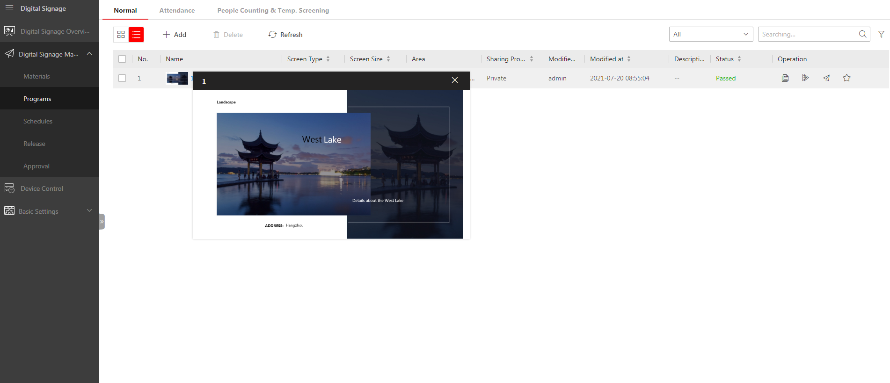
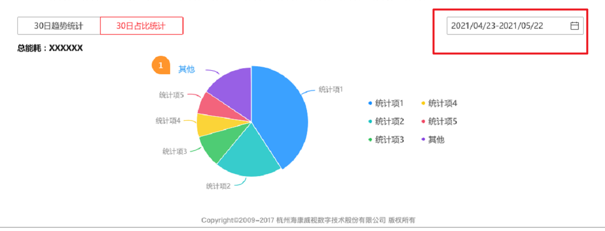
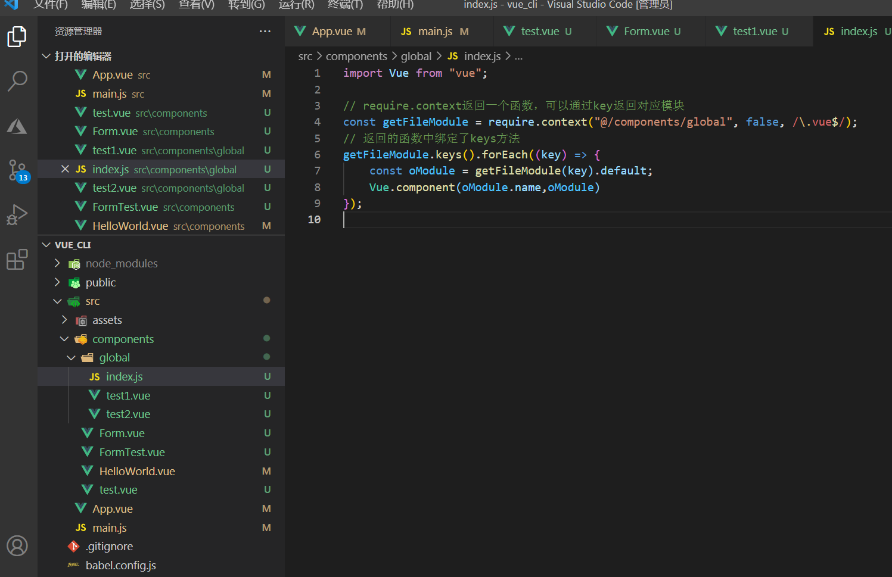
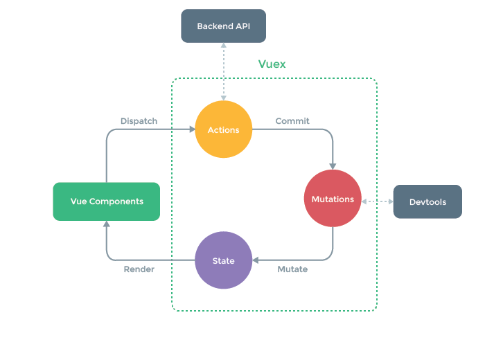

# Vue 高阶用法或最佳实践

-   组件通信（增加 vuex 和本地存储如 sessionStorage 的对比）
-   渲染函数和 JSX
-   组件和 mixin 对比，使用场景区分
-   vuex 中 mutation 和 aciton 对比
-   watch 和 computed 对比
-   require.context 运用（如全局组件注册）

## 一、组件通信

### 1. props、event / \$emit

最常用的父子组件通信。
v-model => :value="xx" $emit('input', xx);
:a.sync="xx" $emit('update:a', xx); => :a="xx" @update:a="" \$emit('update:a', xx);

### 2. ref / refs

比较常用用于父组件调用子组件方法
this.refs.form.getForm();

### 3. $children / $parent

和 refs 类似

### 4.Vuex

常用。
全局状态管理仓库
state: 状态 mapState
getters: 如 vue 中的计算属性一样，基于 state 数据的二次包装，常用于数据的筛选和多个数据的相关性计算 mapGetters
mutations: 改变状态的唯一途径(方便状态溯源)。 mapMutations comit
actions: 可以是业务代码和异步请求，后 comit mutations 的方法改变状态，不能直接该状态。mapActions dispatch

### 5. $attrs $listeners

vue 2.4 引入了 $attrs 和 $listeners；
$attrs：父作用域中不作为 prop 被识别的 attribute 绑定 （除了class 和 style之外）v-bind="$attrs"可以传递给子组件。
$linstener: 包含了父作用域中的v-on 事件监听器。它可以通过 v-on="$listeners" 传入内部组件——在创建更高层次的组件时非常有用。

### 6. provide/ inject

不太常用。祖先组件注入给下级组件。

### 7. eventBus

不推荐用。
eventBus 被称为事件总线，在 vue 中可以使用它来作为沟通桥梁的概念。
$on $emit 利用发布订阅模式。
有点类似第一条的 event 和 emit。区别 eventBus 是可以多个不同层级的组件的通信，太过于自由，当项目较大,就容易造成难以维护的灾难

```javascript
// event-bus.js

import Vue from "vue";
export const EventBus = new Vue();
```

```javascript
import { EventBus } from "./event-bus.js";
EventBus.$on("事件名", () => {});
```

```javascript
import { EventBus } from "./event-bus.js";
EventBus.$emit("事件名", xxx);
```

### 8. localStorage / sessionStorage

不建议组件通信用 localstorage、sessionStorage

## 二、渲染函数 与 jsx

Vue 推荐在绝大多数情况下使用模板来创建你的 HTML。然而在一些复杂场景中，你真的需要 JavaScript 的完全编程的能力。这时你可以用渲染函数，它比模板更接近编译器。
举个很简单的例子。想要渲染一个通过属性来动态渲染 h1、h2

```javascript
<template>
    <h1 v-if="level === 1">
        <slot></slot>
    </h1>
    <h2 v-else-if="level === 2">
        <slot></slot>
    </h2>
    <h3 v-else-if="level === 3">
        <slot></slot>
    </h3>
    <h4 v-else-if="level === 4">
        <slot></slot>
    </h4>
    <h5 v-else-if="level === 5">
        <slot></slot>
    </h5>
    <h6 v-else-if="level === 6">
        <slot></slot>
    </h6>
</template>
```

用到大量的 if 判断，写起来很冗余，写法不灵活。
用 render 函数怎么写？

```javascript
props: {
  level: {
    type: Number,
    default: 1
  }
},
render: function (h) {
    return h(
      'h' + this.level,   // 标签名称
      this.$slots.default // 子节点数组
    )
  }
```

是不是很简单。
jsx 写法

```javascript
render: () => {
    const CustomTag = `h${this.level}`;
    return <CustomTag>{this.$slots.default}</CustomTag>;
};
```

vue template 语法简单明了，数据操作与视图分离，开发体验友好。但是在某些特定场合中，会限制一些功能的扩展，扩展难度大，不易扩展。可能会造成逻辑冗余，如解析字符串类型的模板文件等。以上功能的实现可以借助 vue 的 render 语法，render 语法比 template 更偏底层，允许在 HTML 中使用 js 语法，可以极大的扩展 HTML 的能力。
render 函数注入了一个参数 createElement,用来创建我们所需要的标签内容，有三个参数：HTML 标签（elementTag），标签属性（option），子元素（children）;从 createElement 的参数列表里面可以看出，如果组件内部结构嵌套比较深，render 的语法写起来会比较繁琐，需要不断的调用 createElement，jsx 也是一种很好的选择，区别在于 jsx 可以像我们写 HTML 文件一样写业务代码，借助于 babel，会将 jsx 语法转换成 render 语法。
总结：
1、render 渲染方式可以让我们将 js 发挥到极致，因为 render 的方式其实是通过 createElement()进行虚拟 DOM 的创建。逻辑性比较强，适合复杂的组件封装。
2、template 是类似于 html 一样的模板来进行组件的封装。
3、render 的性能比 template 的性能好很多
4、render 函数优先级大于 templatea

## 三、组件 & Mixin

组件是从页面、样式到逻辑的全面复用，通过传参保持有限的个性。
Mixin 只是对逻辑的复用，说白了就是 vue 中的 js 代码。可以在两个完全不同页面的 vue 文件中使用。再打个比方，比如我们再写多个 js 文件的时候，会把相同逻辑提取出来，Mixin 在 vue 中是同样的道理。
Mixin 应用场景：


信发中有这么一个功能，需要在有些地方，当鼠标移入时对图片进行放大查看。它其中牵扯到一些其他逻辑需要在父级页面编写，比如鼠标移出延时关闭，放大图片位置计算等。这些逻辑需要在多处地方复用，但是你又无法把整套东西写成一个组件。这时候就可以用 mixin。

## 四、watch & computed

computed: 一个变量依赖于多个变量状态的变化。

computed set 的使用


```
<template>
    <el-date-picker v-model="statisticsTime" type="daterange" />
</template>
computed: {
  // 多日能耗查询时间段
  statisticsTime: {
    get() {
      return [this.startTime, this.endTime];
    },
    set(timeRange) {
      if (Array.isArray(timeRange)) {
        this.startTime = timeRange[0];
        this.endTime = timeRange[1];
        this.updateMulDaysEnergy();
      }
    }
  }
},
```

在上述场景中，el-date-picker 组件需要绑定一个数组，但是在请求传参或者处理数据的时候，分开成开始时间和结束时间更加方便，所以使用 computed 的 get 属性，而 v-model 绑定的变量又会被直接改变，这时就需要用 set 将变化反设置回去，并且可以添加处理事件。

watch： 变量变化导致发生了事件，而不是改变了数据。比如变量改动需要发送请求。

个人习惯倾向优先使用 computed，因为感觉更加简洁，但是有时候必须用 watch，比如说你需要深度监听。

## 五、require.context
require.context是一个 webpack 的 api,在前端工程中实现自动化导入，省去了我们一个一个导入的麻烦。
应用场景：vue 中的全局组件注册、图片文件引入等。



```
// index.js

import Vue from "vue";
// require.context返回一个函数，可以通过key返回对应模块
const getFileModule = require.context("@/components/global", false, /\.vue$/);
// 返回的函数中绑定了keys方法
getFileModule.keys().forEach((key) => {
    const oModule = getFileModule(key).default;
    Vue.component(oModule.name,oModule)
});
```

既然是 webpack 的 api， webpack 构建的工程都可以使用。

## 六、vuex 中 Mutations & Acitons


